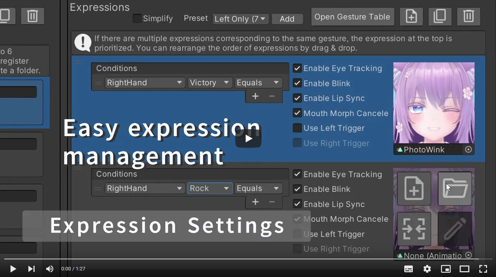
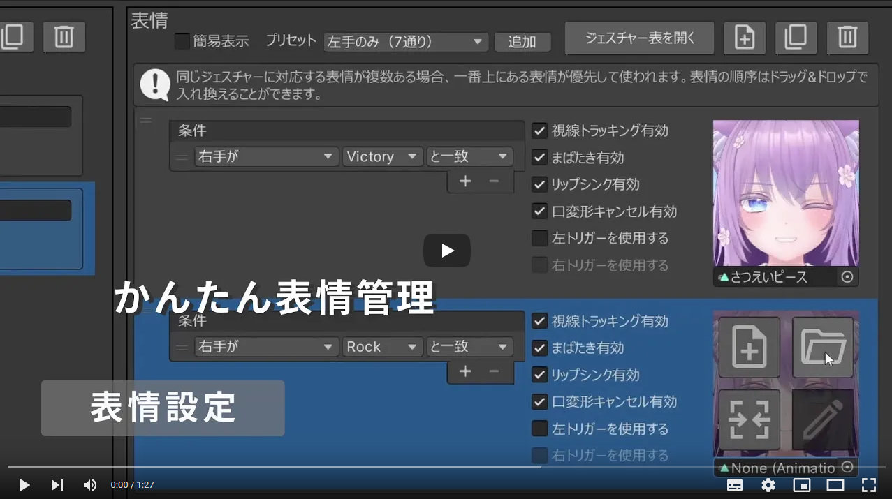

FaceEmo is a facial expression creation and configuration tool for VRChat Avatars 3.0.  
It allows for easy configuration of facial expression changes using hand gestures and the Expression Menu!

[](https://www.youtube.com/embed/hZIHdWUONHM?rel=0)

For more information, check out the [documentation](https://suzuryg.github.io/face-emo/).

---

FaceEmoはVRChat Avatars 3.0用の表情作成・設定ツールです。  
ハンドジェスチャーとExpression Menuを組み合わせた表情切り替えを簡単に設定できます！

[](https://www.youtube.com/embed/Y3taqFjOjZ8?rel=0)

詳細については[ドキュメント](https://suzuryg.github.io/face-emo/ja/)をご参照ください。

---

This repository uses symbolic links. To clone and use this project correctly on Windows, you must perform the following two steps before cloning:

#### 1. Enable Symlink Support in Git
By default, Git on Windows may check out symlinks as plain text files. To prevent this, open your terminal and run:
```bash
git config --global core.symlinks true

```

#### 2. Enable Developer Mode in Windows

Windows restricts the creation of symlinks for standard users, which will cause a `Permission denied` error during setup. To fix this permanently:

1. Open Windows **Settings**.
2. Go to **Privacy & security** > **For developers**.
3. Turn on the **Developer Mode** toggle.
