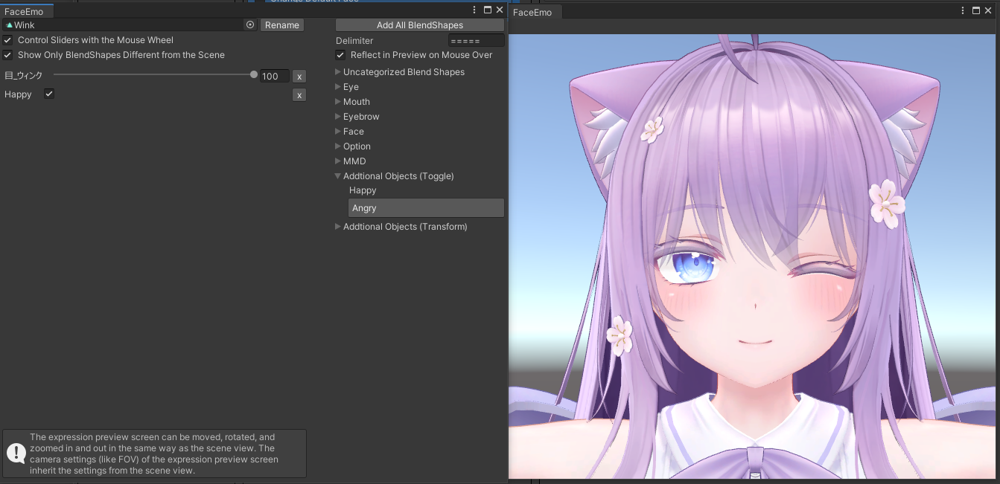

# Linking particles with expressions

By adding objects to "Additional Expression Objects (Toggle)", you can control the ON/OFF status of the objects at the same time as the expressions.  

## Adding objects

Open "Additional Expression Objects (Toggle)" in the inspector and add the objects you want to control.  

:::tip
Objects added here will revert to their default state when they are not being controlled by animations.  
Therefore, you do not need to create an animation to reset them to their default state.
:::

---

## Setting the ON/OFF status of objects in expression animations

Objects added to "Additional Expression Objects (Toggle)" will be available in the expression editor.  
Add the objects to the animation like you would with blend shapes, and set their ON/OFF status.  
Please note that turning particles ON/OFF will not be reflected in the animation preview.

