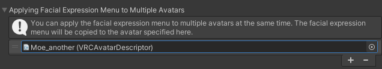
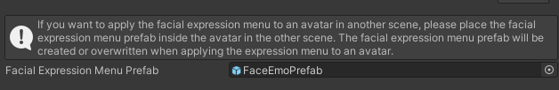

# Applying Facial Expression Menu to Multiple Avatars

When applying an facial expression menu to an avatar, you can apply the same facial expression menu to multiple avatars at the same time.

:::caution
In order to commonize the facial expression menu, the blend shapes of the face must be common.  
Basically, use it for avatars of the same base body.
:::

## Applying Facial Expression Menu to Avatars in the Same Scene Simultaneously

Select the "FaceEmo" object in the hierarchy and open "Apply Facial Expression Menu to Multiple Avatars" in the inspector.  
Press the "+" button to add the target avatar and specify the avatar to which you want to apply the facial expression menu.

When you apply the facial expression menu to the avatar in this state, the expression menu is copied to the specified avatar.

---

## Applying Facial Expression Menu to Avatars in Different Scenes Simultaneously

Select the "FaceEmo" object in the hierarchy and open "Apply Facial Expression Menu to Multiple Avatars" in the inspector.  
When you click on "Facial Expression Menu Prefab", the prefab is selected in the Project view.

:::tip
The "Facial Expression Menu Prefab" is initially set to None and is generated when you apply the expression menu to the avatar.
:::

When you place this prefab inside the avatar, the expression menu is applied at the time of uploading the avatar.  
The contents of the prefab are updated each time you apply the facial expression menu to the avatar.

