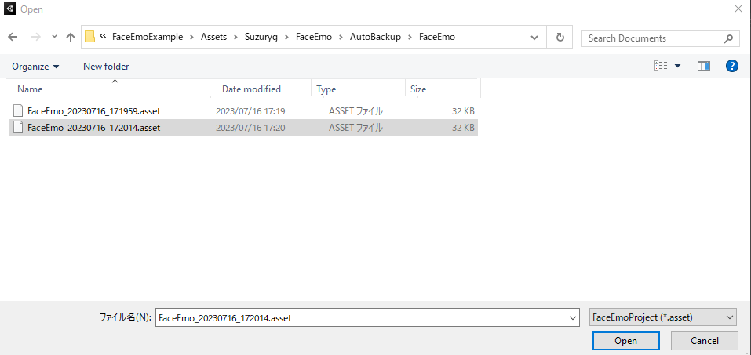

# Restoring the Facial Expression Menu from Auto Backup

If the facial expression menu you created disappears for some reason, you can restore it from the automatic backup.

Execute "FaceEmo" → "Restore Menu" from the toolbar.

When the file selection screen opens, select the backup data you want to use for restoration from "Assets/Suzuryg/FaceEmo/AutoBackup".

:::tip
- Automatic backup is created when the facial expression menu is applied to the avatar.
- Backup data is created for each facial expression menu up to 100 items, and when it exceeds 100 items, older ones are deleted.
- The backup data does not contain animation clips, so you cannot restore animation clips.
:::

When you open the backup data, the restored facial expression menu is created in the hierarchy.

