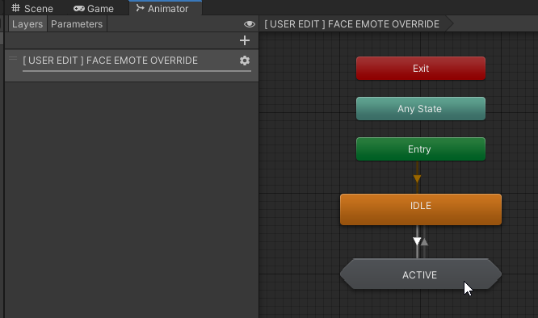

# Setting up Expressions when Head Stroked

You can set up the expression when a certain place is touched by following the steps below.

Right-click in the Project view, select "Create" → "FaceEmo_EmoteOverrideExample", and Prefab and AnimatorController will be created.

Open the created AnimatorController and double-click on "ACTIVE".

Click on "NadeNade" and set arbitrary expression animation to "Motion".

Place the Prefab in the hierarchy, and deploy it inside "FaceEmoPrefab".  
When you upload the avatar in this state, the expression will be overwritten when another player's hand touches your head.

:::tip
If "FaceEmoPrefab" does not exist within the avatar, please first apply the facial expression menu to the avatar.
:::

:::tip
By modifying based on FaceEmo_EmoteOverrideExample, you can set "Contacts" not only on the head but also other places.
:::
