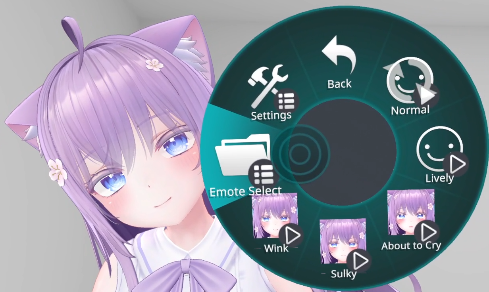
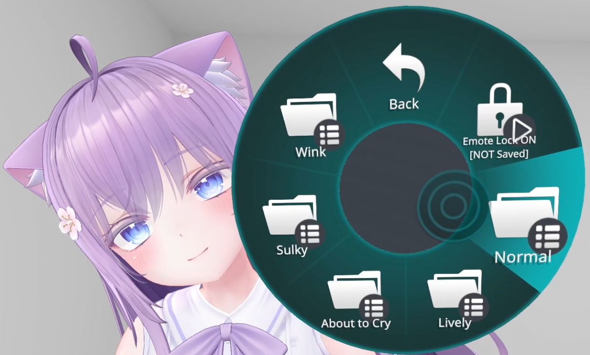
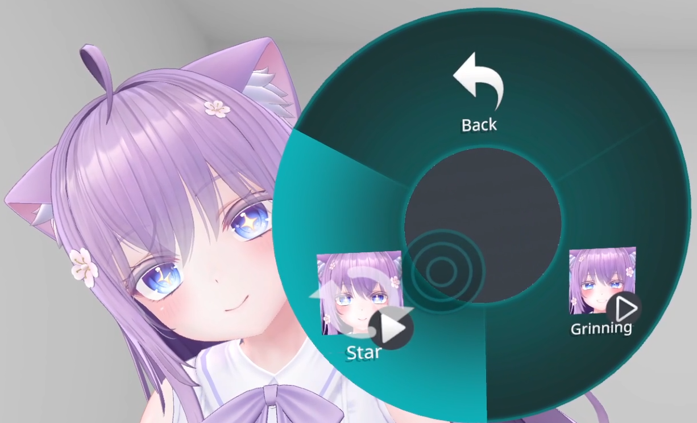
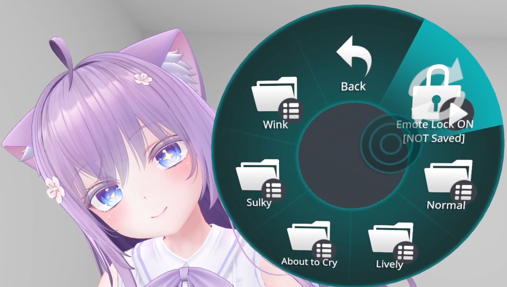
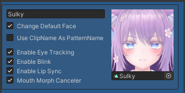
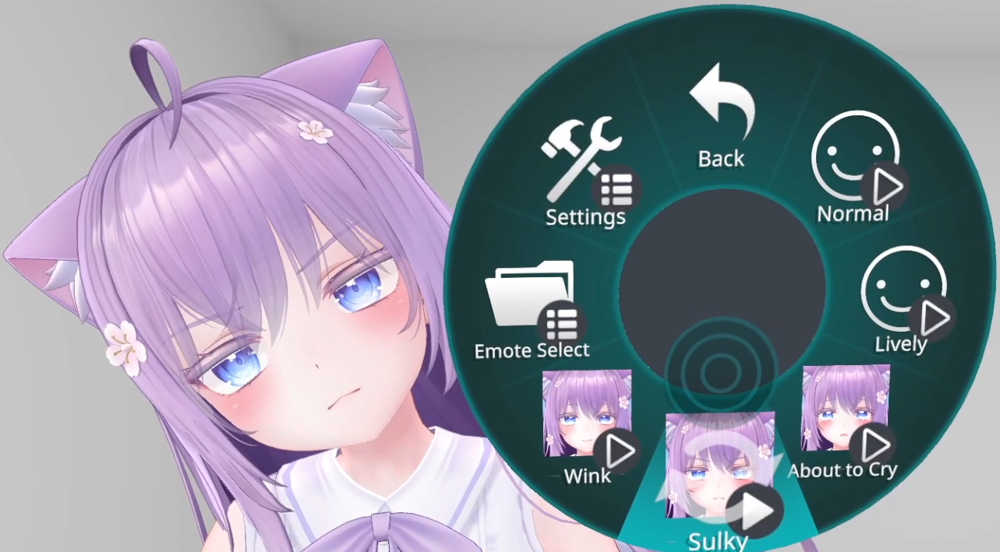
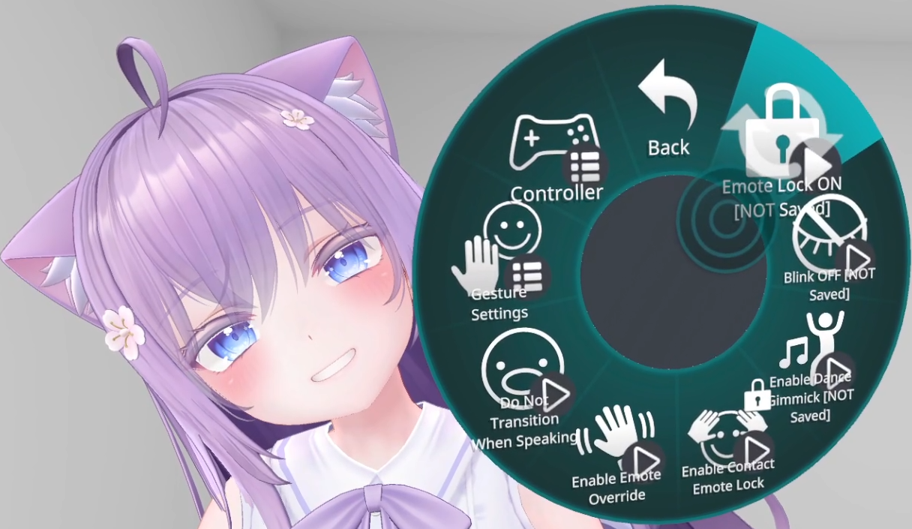
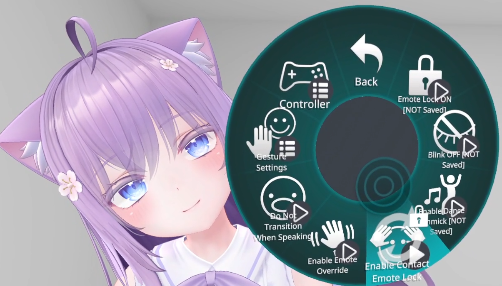

# Lock Expressions

You can lock expressions using any of the following methods:

- [Choose an expression from the "Emote Select" menu](#choose-an-expression-from-the-emote-select-menu)
- [Add an expression pattern for locking expressions](#add-an-expression-pattern-for-locking-expressions)
- [Enable "Emote Lock ON"](#enable-emote-lock-on)
- [Use "Contact Emote Lock"](#use-contact-emote-lock)

## Choose an expression from the "Emote Select" menu

Open "FaceEmo" → "Emote Select" from the VRChat Expression Menu.

:::caution
While the "Emote Select" menu is open, expression changes due to hand gestures are disabled.  
If the expressions are not changing with hand gestures, please check whether the "Emote Select" menu is open in the VRChat Expression Menu of either hand.
:::

Since expressions are sorted by expression patterns, choose the expression pattern that contains the expression you want to lock.

Selecting an expression here will use the selected expression regardless of hand gestures.  

:::tip
- If there are more than 9 expressions in an expression pattern, they are sorted into folders with 8 expressions each, starting from the top.
- If a default expression is set in the expression pattern, it will also be displayed here.
:::

When you leave the "Emote Select" menu, the expression lock is released.  
If you want to keep the expression lock even after leaving the "Emote Select" menu, enable "Emote Lock ON" in the "Emote Select" menu.

---

## Add an expression pattern for locking expressions

By adding an expression pattern with only a default expression set, you can select and lock expressions in the same way as in the "Emote Select" menu.  
You can add expression patterns anywhere, so it's convenient to set frequently used expression locks in this way.

---

## Enable "Emote Lock ON"

If you enable "FaceEmo" → "Settings" → "Emote Lock ON" from the VRChat Expression Menu, the expression at that time will be locked.  
When you disable "Emote Lock ON", the expression lock will be released.

---

## Use "Contact Emote Lock"

When you enable "FaceEmo" → "Settings" → "Enable Contact Emote Lock" from the VRChat Expression Menu, you can use the function to lock expressions with "Contacts".

By keeping both hands on top of your head for 2 seconds, a sound will play and the current expression will be locked.  
Doing the same operation again will play a sound, and the expression lock will be released.

