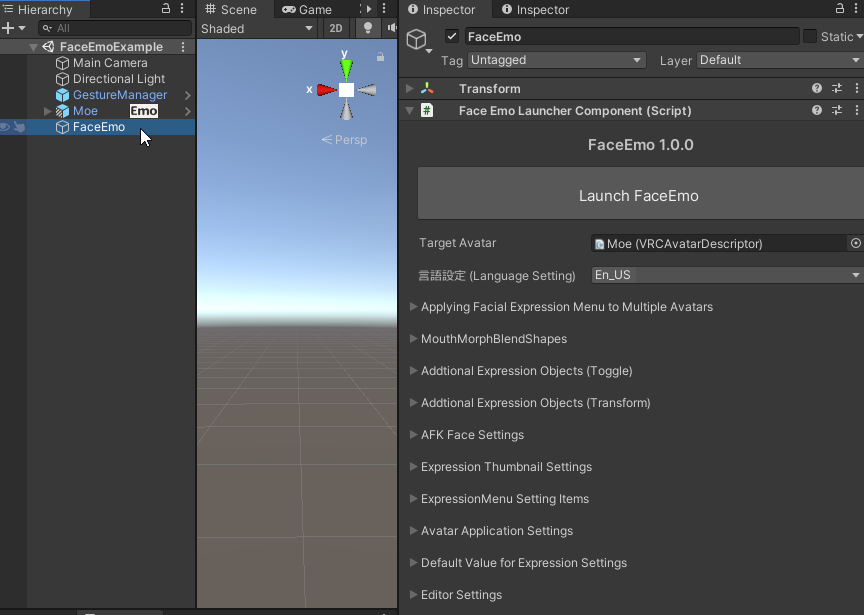

# Optional Features

This section explains how to use the optional features of FaceEmo.  
For some optional features, you will use the FaceEmo settings screen. Select the "FaceEmo" object in the hierarchy and display the screen shown below.

* [Applying Facial Expression Menu to Multiple Avatars](apply-multiple/)
* [Lock Expressions](emote-lock/)
* [Changing expressions based on trigger squeezing](use-trigger/)
* [Preventing corruptions in expressions with lip sync](mouth-morph/)
* [Linking particles with expressions](additional-toggles/)
* [Linking movements of animal ears and "ahoge" with expressions](additional-transforms/)
* [Setting up Expressions when Head Stroked](contact-override/)
* [Changing Expression Settings via VRChat Expression Menu](setting-menu/)
* [Restoring the Facial Expression Menu from Auto Backup](auto-backup/)
