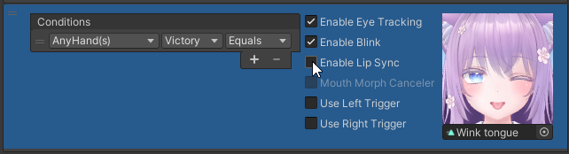
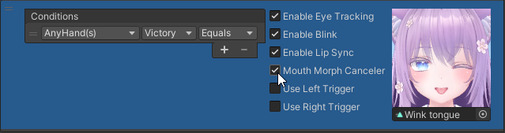
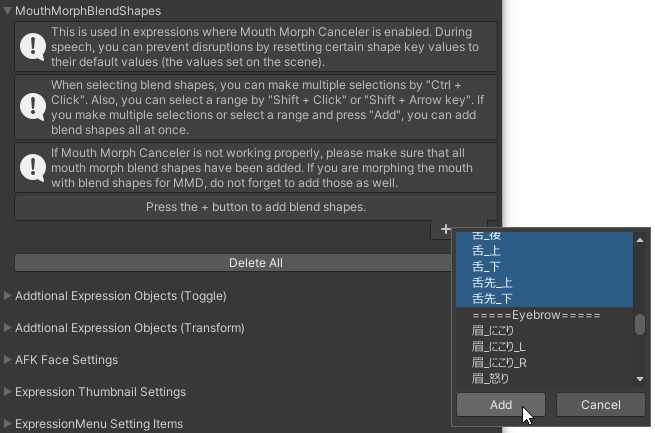

# Preventing corruptions in expressions with lip sync

When lip sync is activated during an expression with the mouth open, the expression may become corrupted.
You can address this by using either of the following methods:
- [Disabling lip sync](#disabling-lip-sync)
- [Canceling mouth morph during lip sync](#canceling-mouth-morph-during-lip-sync)

## Disabling lip sync

For each expression, unchecking "Enable Lip Sync" will disable lip sync for that expression.

---

## Canceling mouth morph during lip sync

Checking "Mouth Morph Canceler" for each expression will enable the mouth morph cancellation feature.
In expressions where mouth morph cancellation is enabled, you can reset specific blend shapes to their default values (the values set in the scene) while speaking.

Blend shapes to be reset to their default values are set in the Inspector's "Mouth Morph Blend Shapes".

:::caution
If mouth morph cancellation does not work well, make sure all mouth morph blend shapes have been added. 
If you are morphing the mouth with MMD-specific blend shapes, don't forget to add them as well.
:::
