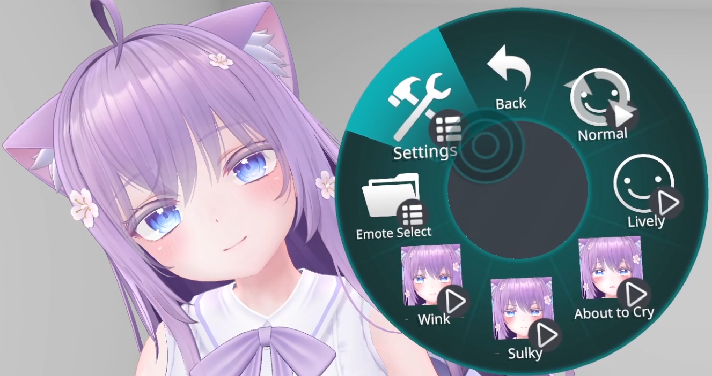
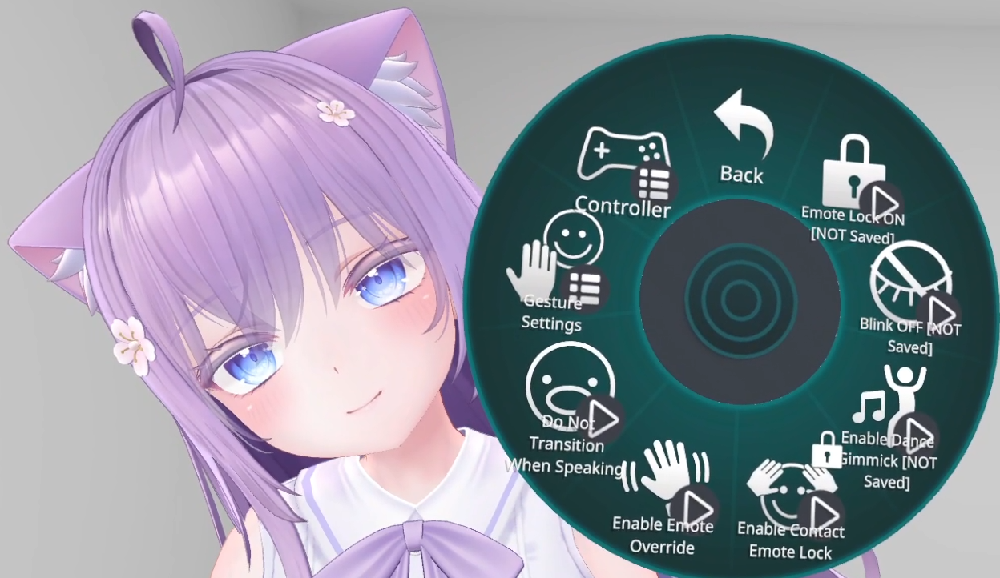
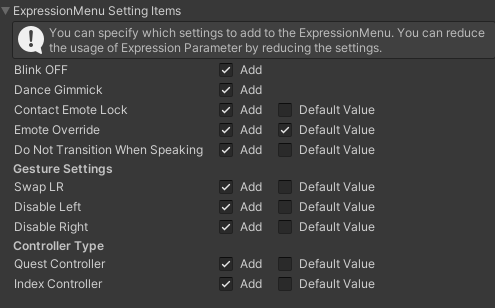

# Changing Expression Settings via VRChat Expression Menu

You can open "FaceEmo" → "Settings" from the VRChat Expression Menu to change the settings of expressions.

|
Item
|
Settings
|
|:-:|:-|
|Emote Lock ON|When ON, you can lock the expressions.|
|Blink OFF|When ON, you can disable blinking.|
|Dance Gimmick|When ON, expressions will move in sync during dance gimmicks. The FX layer functionality is disabled, so if you're using outfit changes, etc., it will return to the default state.|
|Contact Emote Lock|When ON, the feature to lock expressions via "Contacts" becomes available.  Placing both hands on top of your head for 2 seconds will play a sound, and your expression will be locked. Doing the same action while the expression is locked will release the lock.|
|Emote Override|When ON, the feature to overwrite expressions via "Contacts" becomes available.  Please use it with FaceEmo_EmoteOverrideExample integrated into your avatar. [The feature to overwrite expressions via Contact is explained here.](../contact-override)|
|Do Not Transition When Speaking|When ON, expressions will not change while speaking.  If there are expressions with lip-sync disabled, enabling this will prevent the mouth from being stuck open.|
|Gesture Settings|You can change the settings for the gestures used to change expressions. Swap LR: Swaps the left and right gestures for changing expressions Disable Left: Disables expression changes due to left hand gestures (treated as Neutral) Disable Right: Disables expression changes due to right hand gestures (treated as Neutral)|
|Controller Type|You can disable gestures that are easily misinput on each controller Quest Controller: Disables expression changes due to Open gesture (treated as Neutral) Index Controller: Disables expression changes due to Fist gesture (treated as Neutral)|

Items to be added to the settings menu and their default values are set in the "Expression Menu Setting Items" in the inspector.

