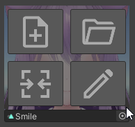
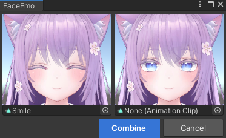
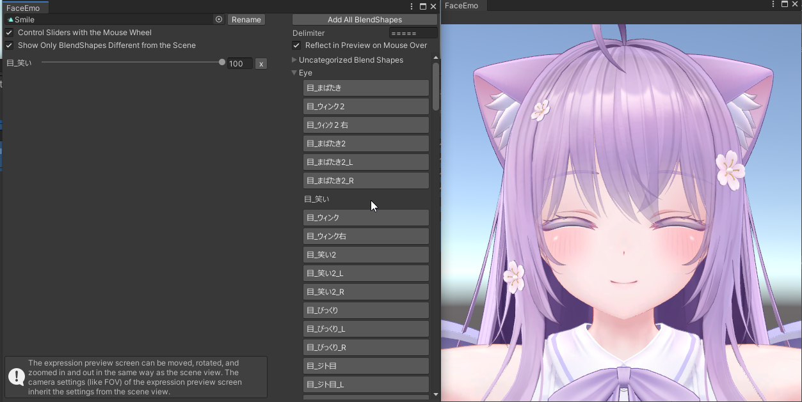
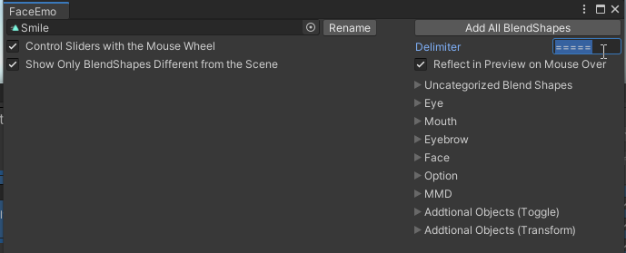
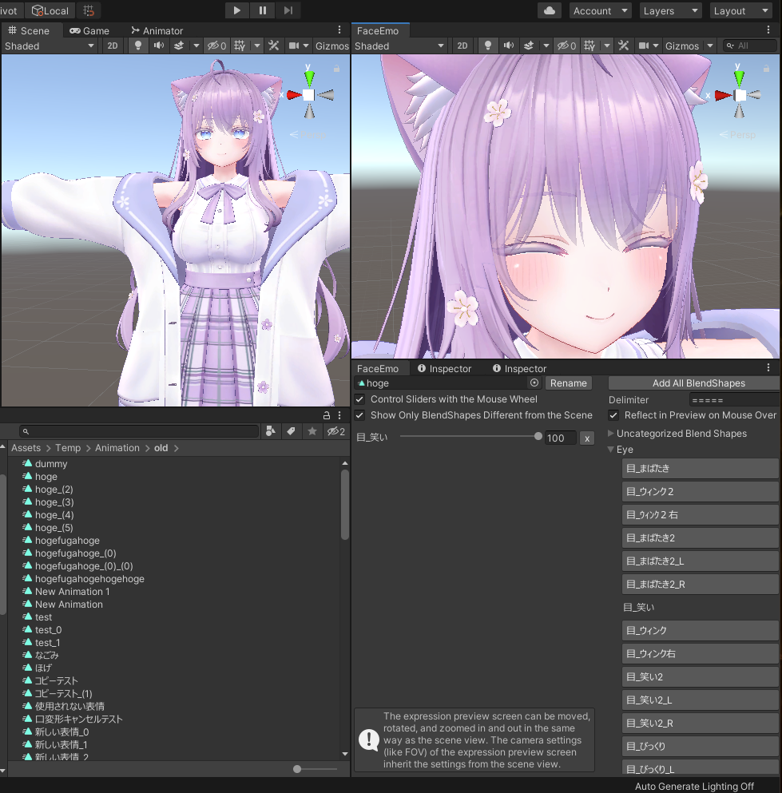

# Expression Editor

In the Expression Editor, you can edit expression animations.

## Opening the Expression Editor

When you hover over an expression thumbnail, buttons for performing operations related to expression animations will appear.
Here, if you press a button other than "Open", the Expression Editor will open.

|
Action
|
Button Position
|
Description
|
|:-:|:-:|:-|
|Create|Top Left|Creates a new animation clip. Opens the Expression Editor and edits the newly created animation clip.|
|Open|Top Right|Opens an existing animation clip.|
|Combine|Bottom Left|Choose and combine two animation clips. When the same blend shape is used, the one with the higher value takes precedence.|
|Edit|Bottom Right|Opens the Expression Editor and edits the set animation clip.|

:::tip
When combining animations, if you set one of the animations to "None" and execute the combination, the other animation will be copied as it is.

:::

---

## Adding Blend Shapes

Click on the blend shape you want to add to the expression animation and the blend shape will be added, updating the preview.
If you want to change the value of a blend shape, move the slider for each blend shape, or enter a number in the text box.

:::caution
When adding a blend shape, please check to see if any of the following warnings appear.

|
Warning Message
|
Description
|
|:-|:-|
|"Blend shapes for blink are included!"|The blinking animation might overwrite it, and the expression animation might not play correctly.|
|"Blend shapes for lip-sync are included!"|The lip-sync might not work correctly.|
:::

---

## Displaying Blend Shapes by Category

By entering a delimiter for the blend shapes, you can display the blend shapes by category.

The delimiter for the blend shapes differs for each avatar.
- If the category name is like "=====Eye=====", please enter "=====".
- If the category name is like "\*\*\*\*\*Eye\*\*\*\*\*", please enter "\*\*\*\*\*".

---

## Operating the Preview Screen

The preview can be moved, rotated, and scaled in the same way as Unity's scene view.

The camera settings for the preview screen inherit the settings of the scene view.
For example, if you change the FOV while working in the scene view, the changed FOV will be applied to the preview screen as well.

---

## Changing the Layout

The window arrangement of the Expression Editor can be changed freely.
The changed window arrangement will be reflected the next time you start up.

