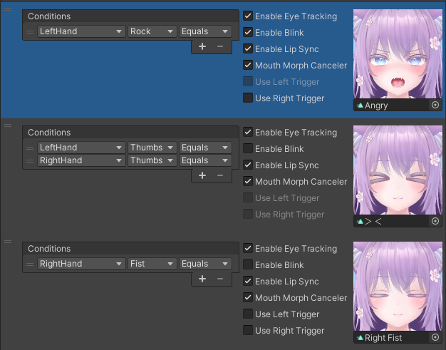

# Expression

In this tool, the conditions for changing expressions are specified by a combination of the following three.
- Type of hand
- Type of hand gesture
- Match or not

|
Condition
|
Behavior
|
|:-:|:-|
|"LeftHand" "Fist" "Equals"|The expression changes when the left hand is in Fist (the state of the right hand is not considered).|
|"BothHands" "Open" "Equals"|The expression changes when both hands are Open.|
|"OneHand" "Point" "Equals"|The expression changes when either the left or right hand is in Point (the expression does not change when both hands are Point).|
|"AnyHand(s)" "Victory" "Equals"|The expression changes when either the left or right hand is Victory (the expression also changes when both hands are Victory).|

You can use a combination of multiple conditions.

|
Condition
|
Behavior
|
|:-:|:-|
|"OneHand" "Rock" "Equals"   +   "OneHand" "Gun" "Equals"|The expression changes when left hand is Rock and right hand is Gun, or left hand is Gun and right hand is Rock.|

When there are multiple expressions, they are evaluated in order from the top.

- For example, if there are two expressions in the order below, the first expression is prioritized, so the first expression is used when the left hand is Fist.
    - "LeftHand" "Fist" "Equals"
    - "OneHand" "Fist" "Equals"
- The order of expressions can be changed by dragging.
- You can check which expression is prioritized in the gesture table.

You can change the following settings for each expression.

|
Item Name
|
Setting Contents
|
|:-:|:-|
|Enable Eye Tracking|You can set whether or not pseudo eye tracking is available. This can be set separately from the availability of blinking.|
|Enable Blink|You can set whether blinking is enabled. Please disable blinking for expressions with closed eyes.|
|Enable Lip Sync|You can set whether lip sync is enabled.  To prevent corruption of the expression during speech, disable lip sync or use mouth morph canceler.|
|Mouth Morph Canceler|During speech, corruption of the expression is prevented by returning the values of certain blend shapes to their default values (the values set in the scene). Specify the blend shapes to be returned to their default values in the inspector's "Mouth Morph Blend Shapes".|
|Use Left Trigger|Changes the expression according to the amount of left hand trigger squeezing. Please set an additional expression for when the trigger is squeezed. The trigger squeezing is only valid when the left hand is Fist.|
|Use Right Trigger|Changes the expression according to the amount of right hand trigger squeezing. Please set an additional expression for when the trigger is squeezed. The trigger squeezing is only valid when the right hand is Fist.|
