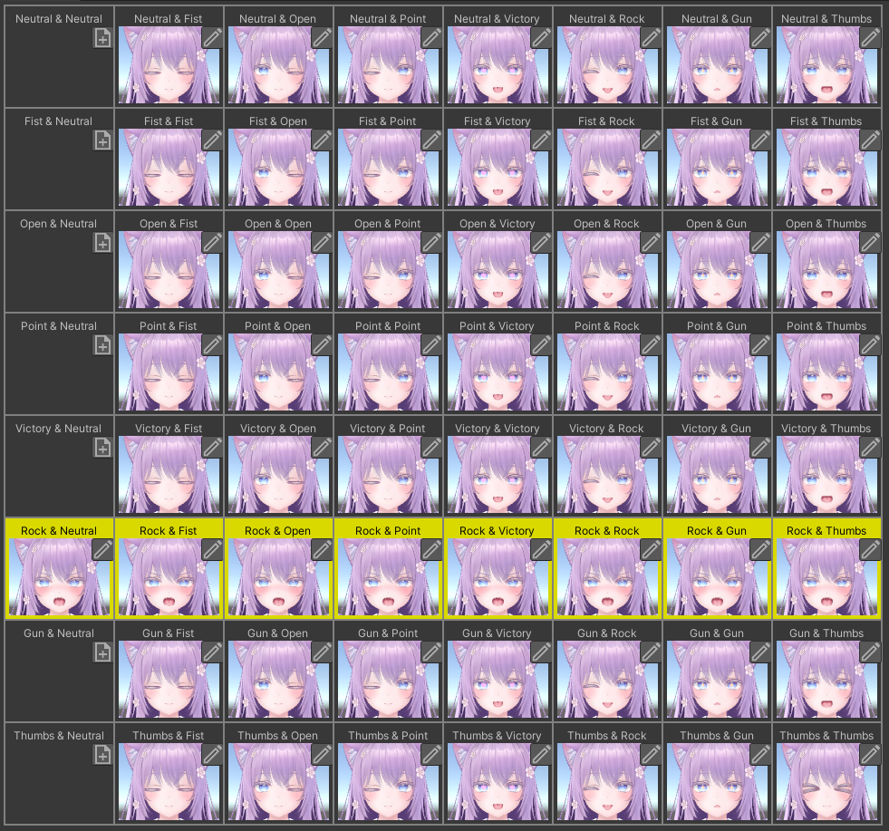

# Gesture Table

You can check which expression corresponds to the combination of left and right hand gestures in the Gesture Table.

- When you select an expression in the "Expressions" view, the gesture corresponding to that expression is highlighted.
- Conversely, when you select a gesture in the gesture table, the expression corresponding to that gesture in the "Expressions" view becomes selected.

Gestures where no expression thumbnail is displayed do not correspond to an expression, so the default expression set in the expression pattern is used.
