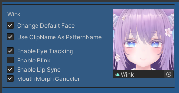

# Expression Pattern

With this tool, by selecting an expression pattern in the VRChat Expression Menu, you can switch multiple combinations of hand gestures and expressions.

Enabling "Change Default Face" allows you to set the default expression for the expression pattern.

- The default expression is used when the left and right hand does not match the hand gesture set for the expressions.
- If you do not set a default expression, the value of the face's shape key set in the scene is used as the default expression.

For the default expression, you can change the following settings.

|
Item Name
|
Setting Content
|
|:-:|:-|
|Use ClipName as PatternName|The name of the set animation clip is used as the name of the expression pattern.|
|Enable Eye Tracking|You can set whether or not pseudo eye tracking is available. This can be set separately from the availability of blinking.|
|Enable Blink|You can set whether blinking is enabled. Please disable blinking for expressions with closed eyes.|
|Enable Lip Sync|You can set whether lip sync is enabled.  To prevent corruption of the expression during speech, disable lip sync or use mouth morph canceler.|
|Mouth Morph Canceler|During speech, corruption of the expression is prevented by returning the values of certain blend shapes to their default values (the values set in the scene). Specify the blend shapes to be returned to their default values in the inspector's "Mouth Morph Blend Shapes".|
