# Setting Combinations of Both Hands' Gestures

As a slightly complex example of the facial expression menu, let's create an facial expression menu like the following:

- Normally, change the expression with the right-hand gesture
- Only when the left hand's gesture becomes Rock, overwrite the right hand's expression and change to an "Angry" expression
- Only when both the left and right hands become Thumbs, overwrite the right hand's expression and change to a "><" expression

## Adding an Expression Pattern

Create a new expression pattern and change the name of the expression pattern to "Interrupt with left hand".

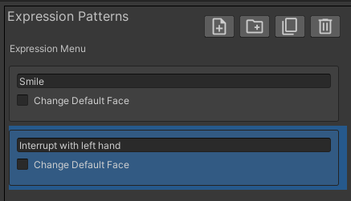

Change the "Default Selected Pattern" to "Interrupt with left hand".

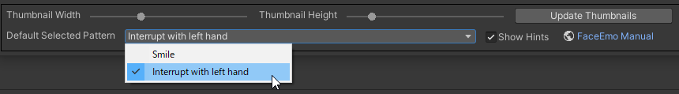

:::tip
If multiple expression patterns exist, you can change the default expression pattern to be used in this way.
:::

---

## Adding Expressions

Select the "Interrupt with left hand" pattern and set the right-hand expressions as shown below.

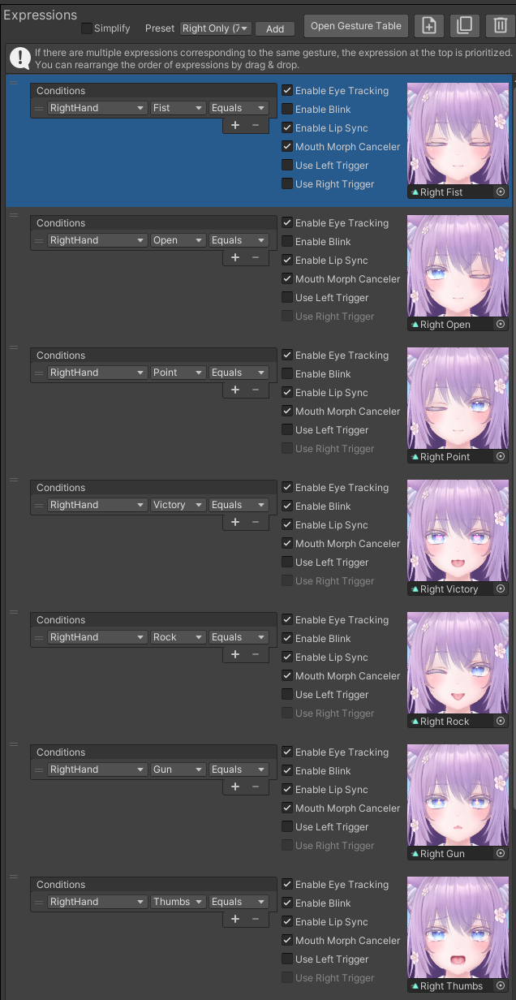

:::tip
By using the expression preset feature, you can add multiple expressions at once.
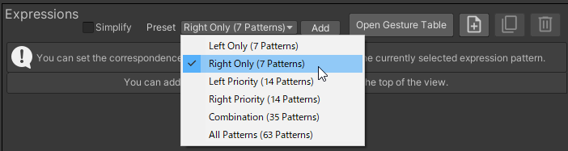
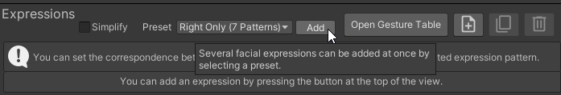
:::

Next, set the expression interruptions by the left hand as shown below.

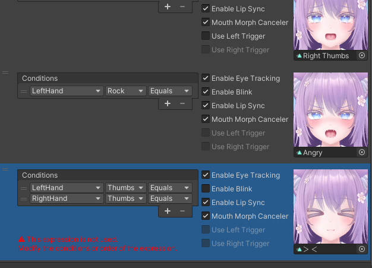

:::tip
By pressing the "+" button, you can add expression conditions.

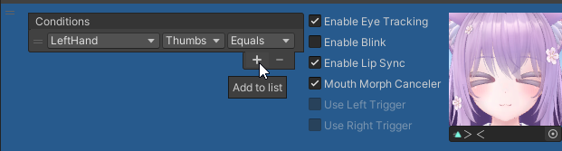
:::

---

## Changing the Priority of Expressions

Press the "Open Gesture Table" button and open the gesture table.

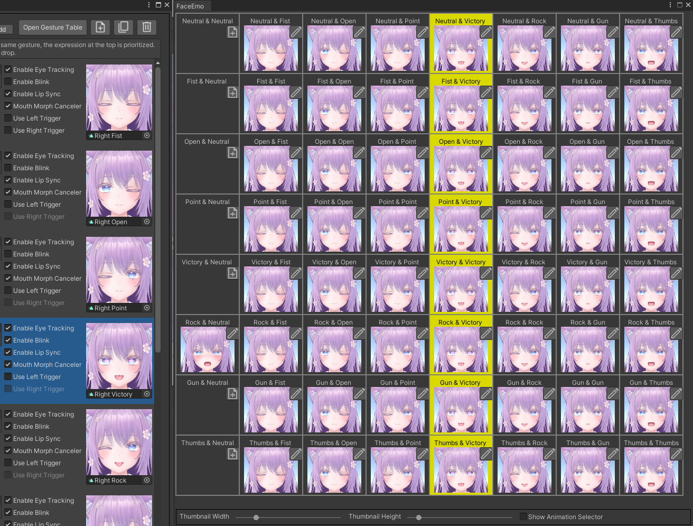

:::tip
By opening the gesture table, you can check which expression corresponds to the combination of both hand's gestures.  
The gesture table is explained in detail in [Reference > Gesture Table](../../reference/gesture-table).
:::

If you select the "Angry" expression, you can see that it only becomes the "Angry" expression when the left hand is Rock and the right hand is Neutral.

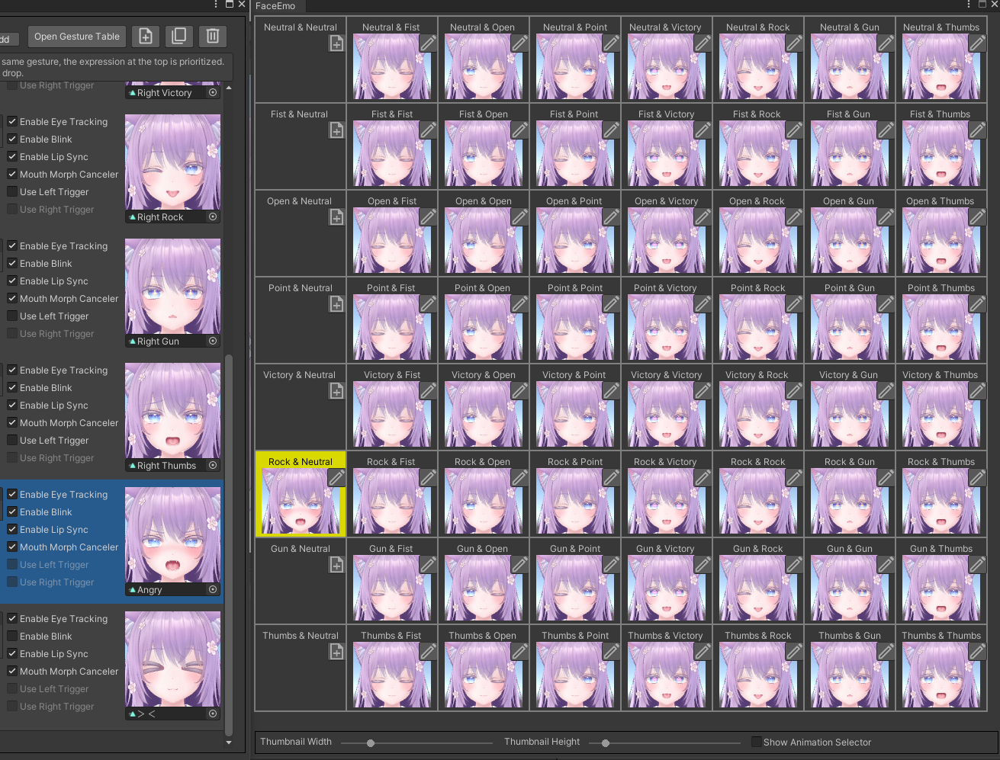

Also, the "><" expression has a lower priority than the "Right Thumbs" expression, so it becomes an unused expression.

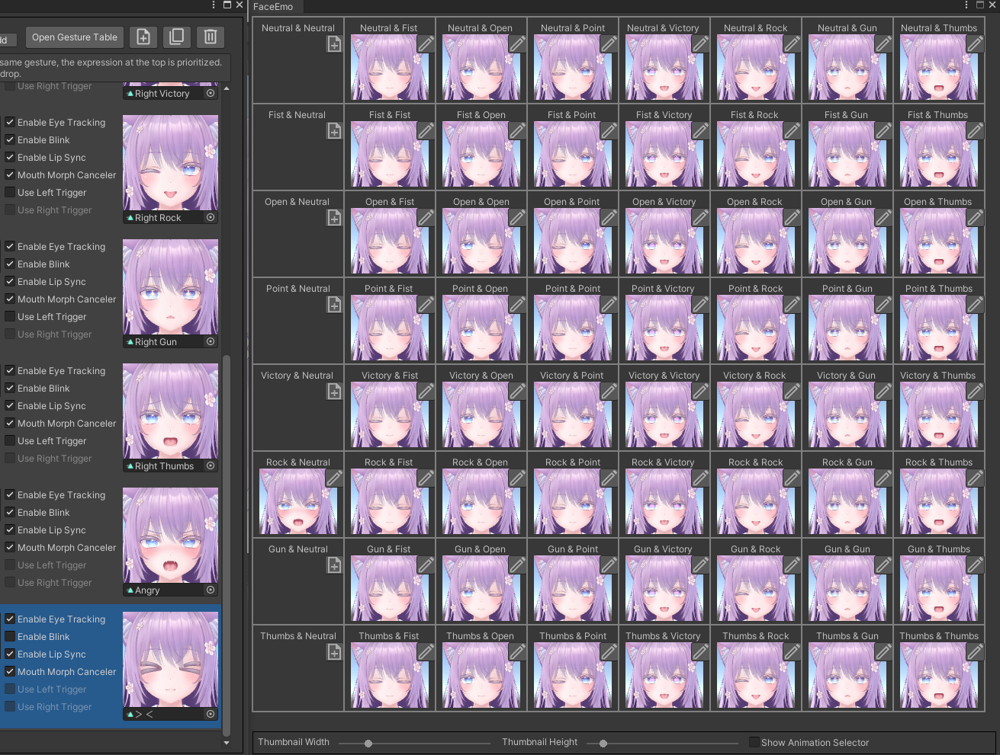

If you drag the "Angry" and "><" expressions to the top, the priority will change.  
The display of the gesture table is updated, and as shown below, you can see that it always becomes an "Angry" expression when the left hand is Rock.

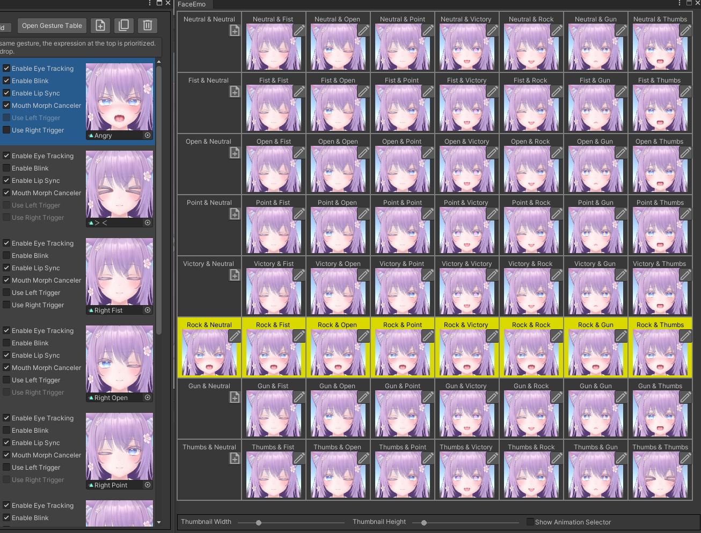

Also, you can see that the "><" expression is used when both hands are Thumbs.

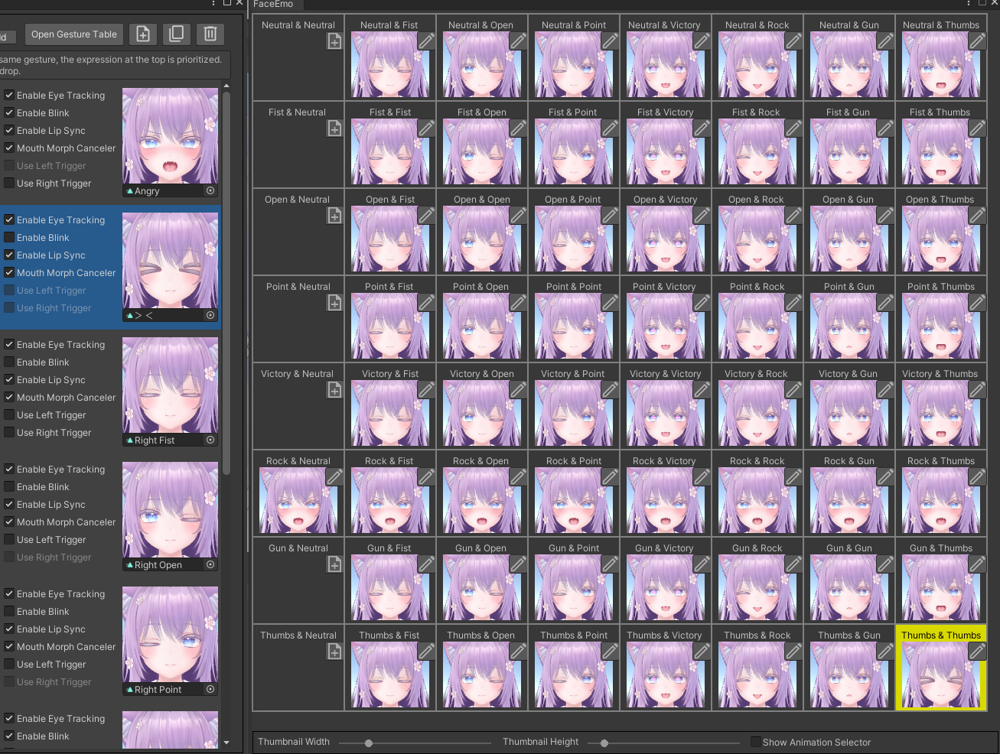

---

## Applying the Facial Expression Menu to the Avatar

By executing "Apply to Avatar" in this state, the creation of the facial expression menu is completed.  
Upload the avatar and confirm that it behaves as follows:

- Normally, change the expression with the right-hand gesture
- Only when the left hand's gesture becomes Rock, overwrite the right hand's expression and change to an "Angry" expression
- Only when both the left and right hands become Thumbs, overwrite the right hand's expression and change to a "><" expression

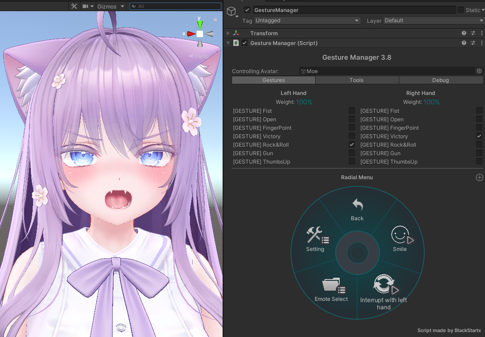
