# Creating a Simple Facial Expression Menu

As a sample for creating an facial expression menu with this tool, let's make an facial expression menu where the "smile" expression is triggered when the gesture of any hands are "Victory".

## Creating a New Expression Menu

When an avatar is placed in the hierarchy, the icon for this tool appears on the right edge of the avatar.

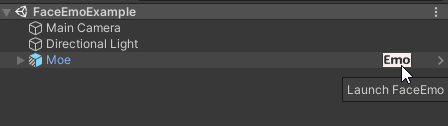

When you click on the icon, an object named "FaceEmo" is created and the window of this tool opens.

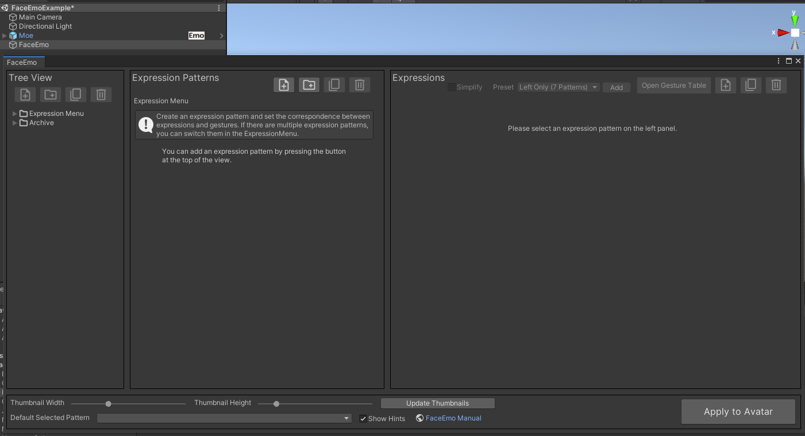

:::tip
The expression menu is stored in the "FaceEmo" object created here.  
When you click the icon when the "FaceEmo" object already exists, the saved expression menu opens.  
The behavior when there are multiple avatars and other detailed specifications are explained in [Reference > Facial Expression Menu](../../reference/menu).
:::

---
## Adding an Expression Pattern

When you click the leftmost button of the "Expression Pattern" view, an expression pattern is added.

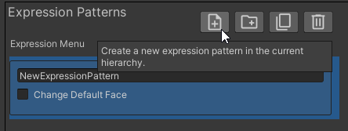

Change the name of the expression pattern to "Smile".

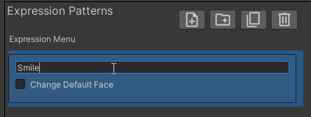

:::tip
By adding an expression pattern, you can set up switching of expression patterns using the VRChat Expression Menu.  
For more about expression patterns, see [Reference > Expression Pattern](../../reference/pattern).
:::

---
## Adding an Expression

When you add an expression pattern, the "Expressions" view will display "You can add expressions by pressing the button at the top of the view." So press the button in the upper right corner of the "Expression View" to add an expression.

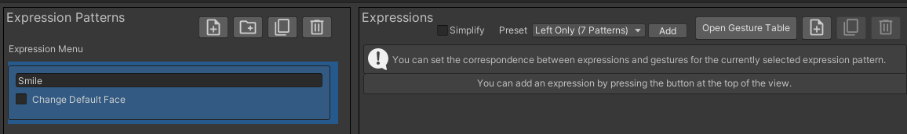
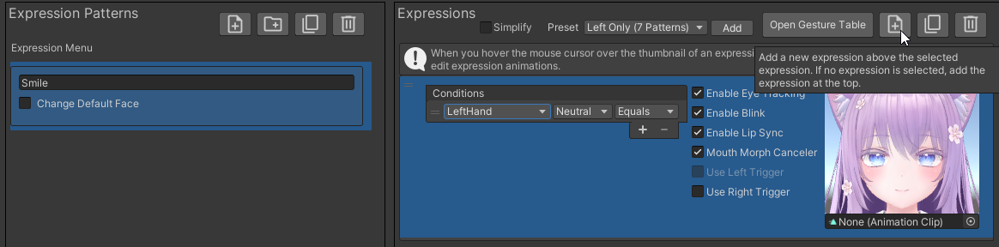

Change the "Conditions" to "AnyHand(s)" "Victory" "Equals".

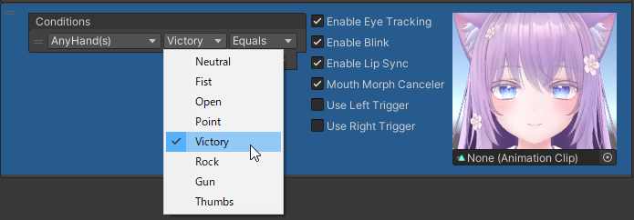

:::tip
By adding an expression, you can set up switching of expressions with hand gestures.  
For more about expressions, see [Reference > Expression](../../reference/expression).
:::

---
## Creating an Expression Animation

When you hover your mouse cursor over the expression thumbnail, buttons appear, so press the button in the upper left.

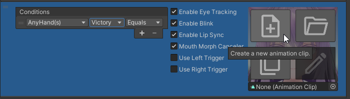

When a window appears for you to specify where to save the expression animation, change the name to "Smile" and press the "Save" button.

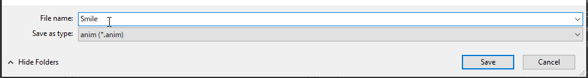

When the expression animation is created, this tool's expression editor opens.

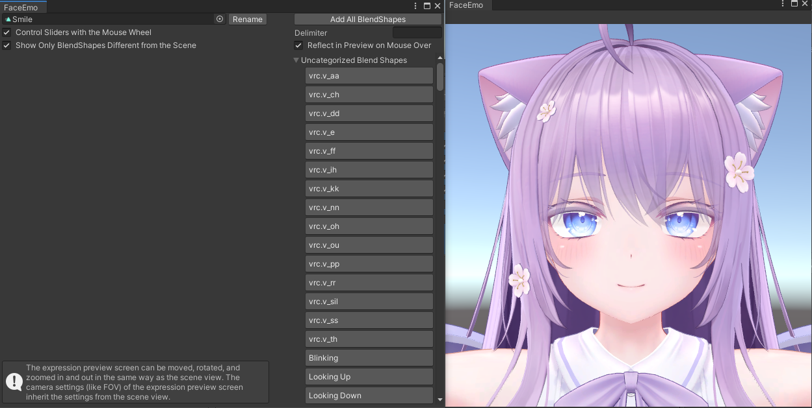

:::tip
In the expression editor, you can edit the expression animation.  
For more about the expression editor, see [Reference > Expression Editor](../../reference/expression-editor).
:::

When you want to add a blend shape to the expression animation, click on the blend shape you want to add and the blend shape will be added, updating the preview.  
If you want to change the value of a blend shape, move the slider for each blend shape, or enter a number in the text box.

:::caution
When you add a blend shape, check that the following warnings do not appear.

|
Warning Message
|
Description
|
|:-|:-|
|"Blend shapes for blink are included!"|The blinking animation might overwrite it, and the expression animation might not play correctly.|
|"Blend shapes for lip-sync are included!"|The lip-sync might not work correctly.|
:::

To prevent the expression from corrupting when blinking occurs while playing the smile expression animation, turn off "Enable Blinking".

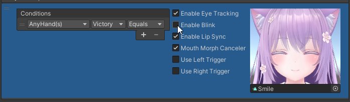

---
## Applying the Facial Expression Menu to the Avatar

When you click the "Apply to Avatar" button, a confirmation window appears, so click "Apply".

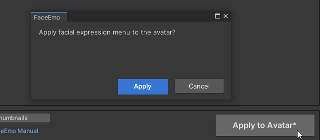

If "Facial expression menu generation is completed!" is displayed, then the creation of the facial expression menu is complete.

- If you upload the avatar in this state, the facial expression menu will be installed into the avatar by Modular Avatar
- If you check the inside of the avatar in the hierarchy, you'll see that an object named "FaceEmoPrefab" has been added
    - If you want to remove the facial expression menu from the avatar, delete this object

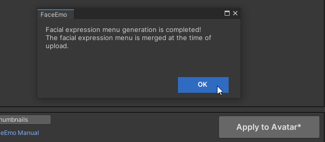
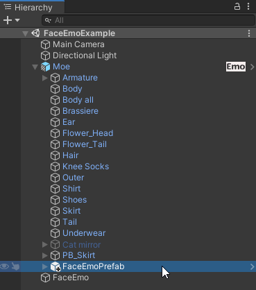

:::caution
### If You Can't Upload

If an error like the one in the picture below occurs, your VRCSDK may not be compatible with Modular Avatar.  
Try updating your VRCSDK and Modular Avatar to the latest version.

:::

Check that the expression changes to a smile when the gesture of any hands are Victory.

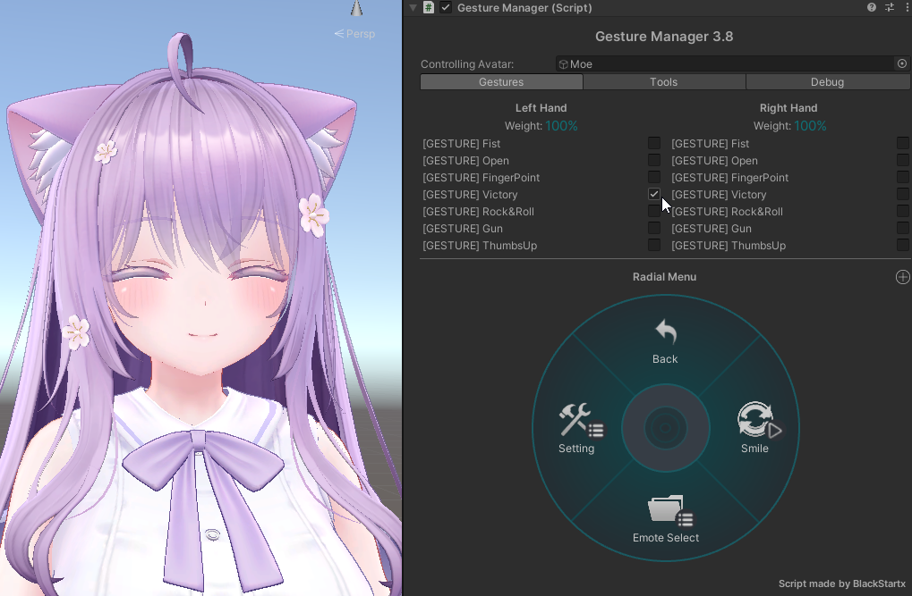

:::caution
### Notes for Previewing in Gesture Manager

- Depending on the version of Gesture Manager or Modular Avatar, the facial expression menu may not apply to the preview. If that happens, try the following steps
    - Press the Unity Play button while not selecting the Gesture Manager object
    - After entering Play mode, select the Gesture Manager object
    - If the avatar does not display well in the Game tab, check the preview in the Scene tab
- If the AFK motion plays, open the Parameters of the Action layer and turn off the check for AFK

:::
