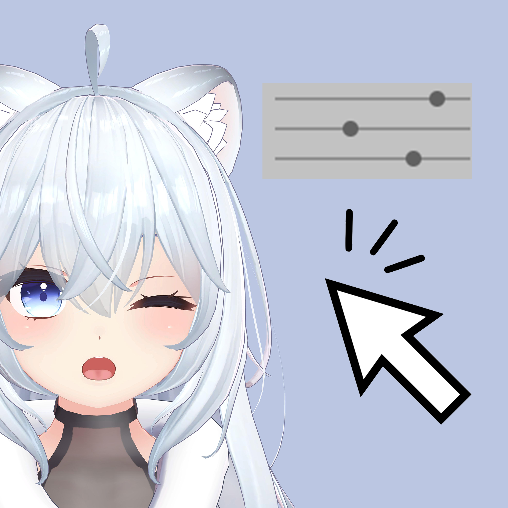
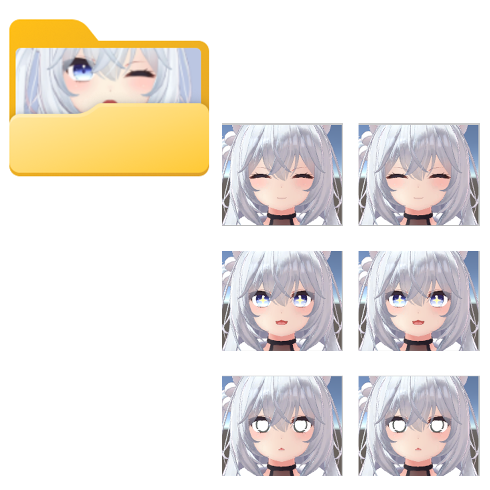
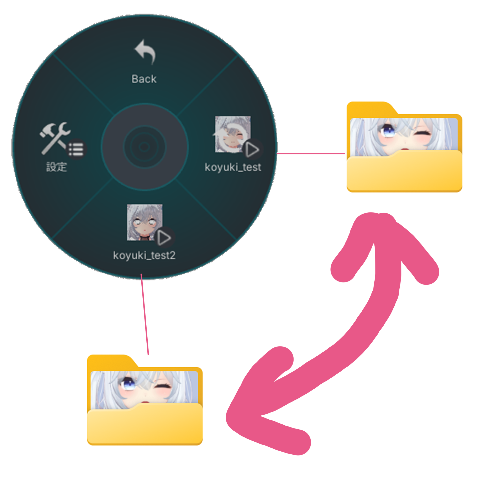

<table>
<tr>
<th> 

</th>
<th>

<header>難しいことはなにもなし</header>

トリガーのウィンク設定もサクッと完了。  
リップシンクのオンオフもボタン一つ。  
もちろん、編集もらくちん。 

</th>
</tr>
<tr>
<th> 

</th>
<th>

<header>らくらく管理</header>

   表情パターンをリスト表示。  
   ジェスチャー組み合わせだって表管理。

</th>
</tr>
<tr>
<th> 

</th>
<th>

<header>切り替え自由</header>

   表情パターンは Ex Menu で切り替え簡単。  
   TPOで使い分け！

</th>
</tr>
</table>

--------

## ▶ FaceEmoでできること
- 表情エディター
- 左右ジェスチャーを組み合わせた表情設定を簡単に作れる
- ハンドジェスチャーとExpression Menuを組み合わせた表情切り替えを簡単に作れる
- 表情エディタを内蔵していて、表情メニュー作成と表情作成をシームレスに行える
- シーン上のデフォルト表情を自動的に反映する
- 表情パターンごとにデフォルト表情を変えられる

## ▶ インストール方法
1. [VRChat Creator Companion](https://vcc.docs.vrchat.com/)を導入 
2. Modular Avatar の リポジトリを登録
3. FaceEmo のリポジトリを登録
4. プロジェクトに最新版を設定  
[unitypackage版](https://github.com/suzuryg/face-emo/releases)

## ▶ 関連ソフトウェア
- [ComboGestureExpression (Integrator)](https://booth.pm/ja/items/2219616)
- [CustomAnimatorController](https://booth.pm/ja/items/4424448)
- [Modular Avatar](https://modular-avatar.nadena.dev/ja/)

## ▶ 更新履歴
2023/XX/XX ver1.0: リリース 

## ▶ Copyright and license
Copyright 2023 [suzuryg](https://twitter.com/suzuryg)   
[MIT License](../software/index.md)