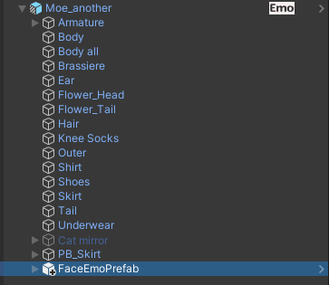

# 複数のアバターに表情メニューを適用する

表情メニューをアバターに適用する際、複数のアバターに対して同じ表情メニューを同時に適用することができます。

:::caution
表情メニューを共通化するためには、顔のシェイプキーが共通である必要があります。  
基本的には、同じ素体のアバターに対して使用してください。
:::

## 同じシーン上のアバターに表情メニューを同時適用する

ヒエラルキー上で「FaceEmo」オブジェクトを選択し、インスペクタで「複数アバターへの表情メニュー適用」を開きます。  
「＋」ボタンを押して対象アバターを追加し、表情メニューを適用したいアバターを指定します。

この状態で表情メニューをアバターに適用すると、指定したアバターに対して表情メニューがコピーされます。

## 別のシーン上のアバターに表情メニューを同時適用する

ヒエラルキー上で「FaceEmo」オブジェクトを選択し、インスペクタで「複数アバターへの表情メニュー適用」を開きます。  
「表情メニューのPrefab」をクリックするとProjectビューでPrefabが選択されます。

:::tip
「表情メニューのPrefab」は初期状態ではNoneになっており、表情メニューをアバターに適用したときに生成されます。
:::

このPrefabをアバターの中に配置すると、アバターのアップロード時に表情メニューが適用されます。  
Prefabの内容は、表情メニューをアバターに適用するたびに更新されます。

