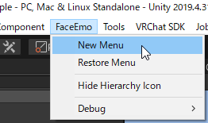
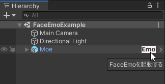

# 表情メニュー

- 本ツールで作成した表情メニューは、シーン上のオブジェクトとして保存されます
    - オブジェクトをコピーすることで、表情メニューをコピーすることができます
- 表情メニューは、ツールバーから「FaceEmo」→「New Menu」を実行すると新しく作成されます

- ヒエラルキー上で表情メニューを選択して、本ツールの起動や表情メニューの設定変更を行うことができます

- ヒエラルキー上でアバターの右端に表示されたアイコンをクリックすると、下記の処理が行われます
    - シーン上の表情メニューをすべてチェックする（名前順でソート）
    - クリックしたアバターが「対象アバター」と一致した場合、その表情メニューを開く
    - クリックしたアバターが「対象アバター」となる表情メニューが存在しなかった場合、新しく表情メニューを作成して開く

