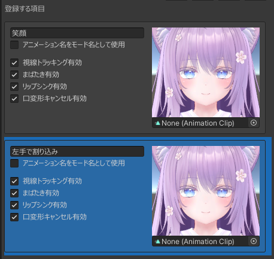
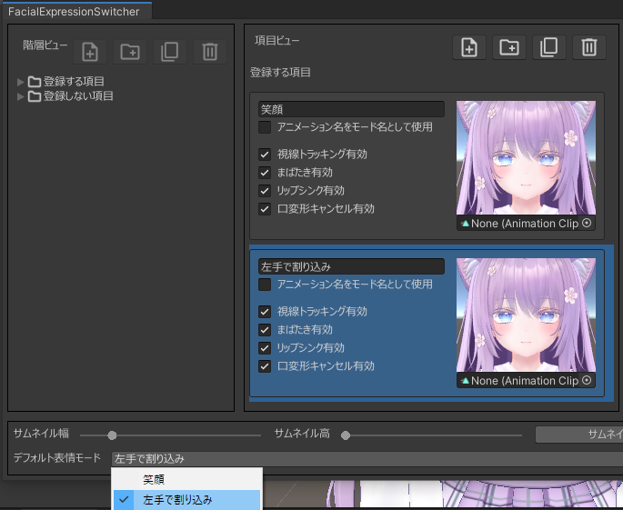
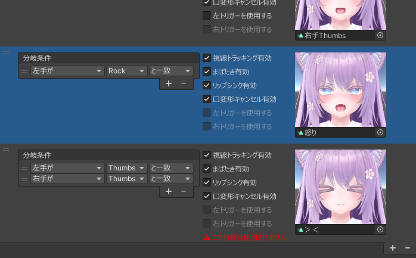
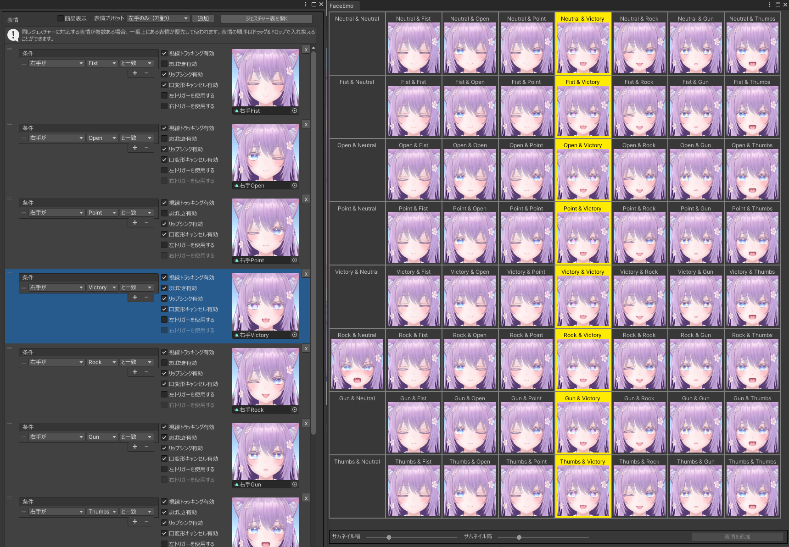
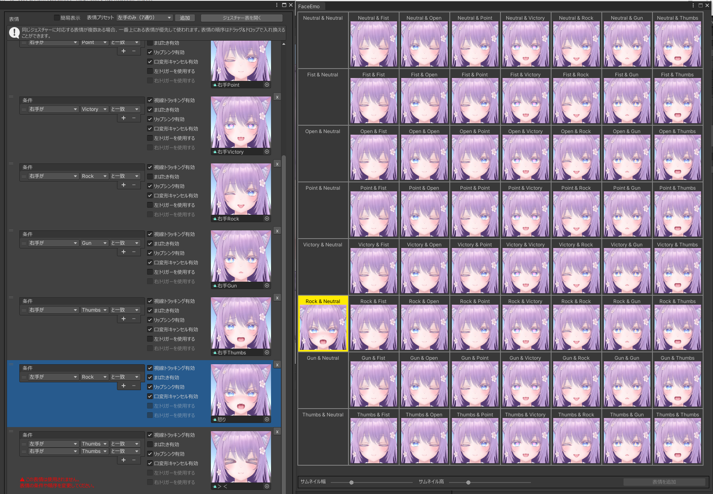
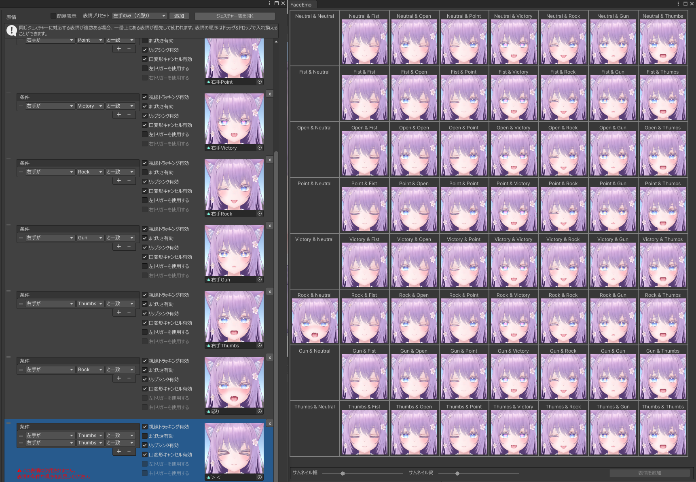
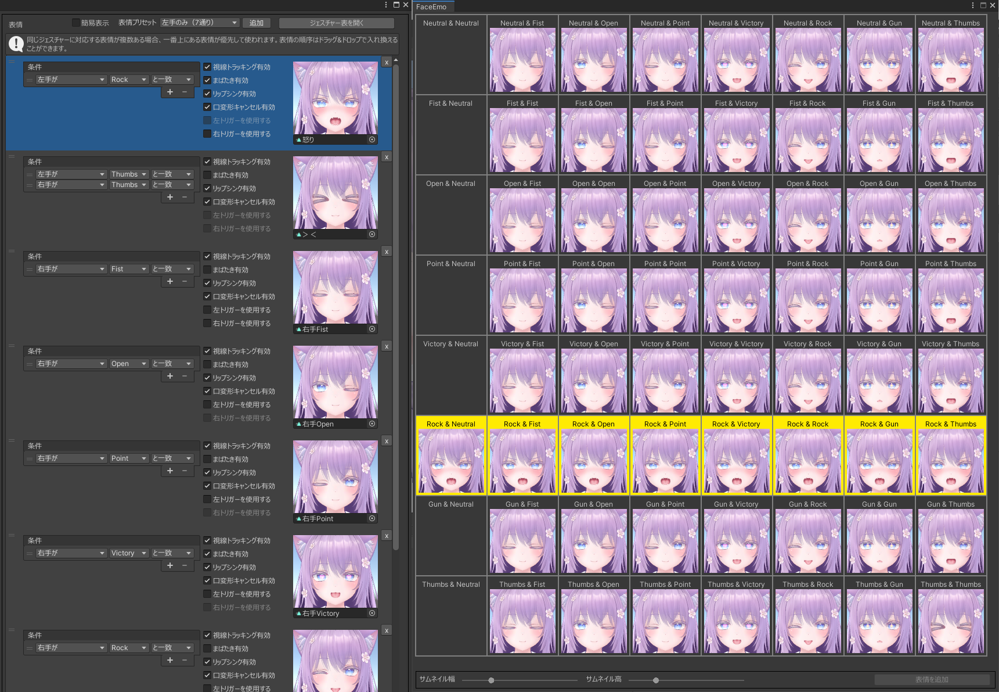
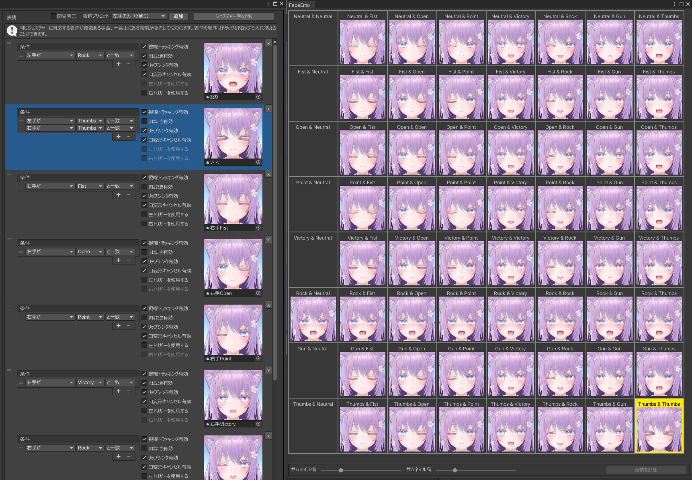
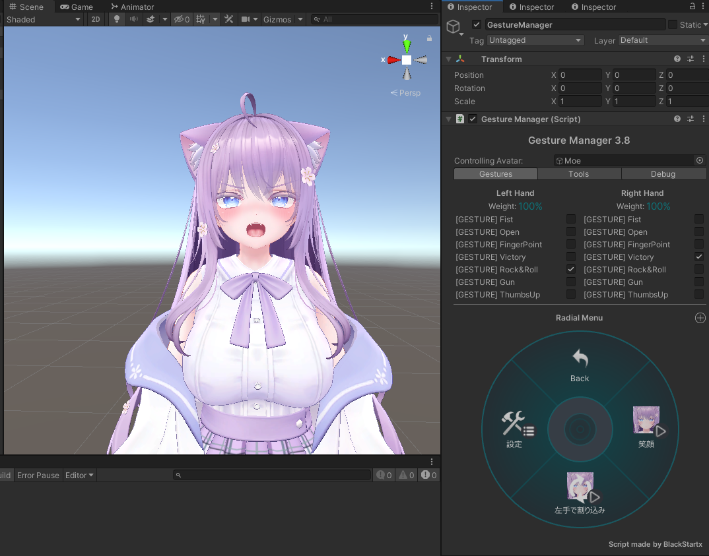

# 両手のジェスチャーの組み合わせを設定する

少し複雑な表情メニューの例として、下記のような表情メニューを作成してみましょう。

- 通常は右手のジェスチャーで表情を変更する
- 左手のジェスチャーがRockになった場合のみ、右手の表情を上書きして「怒り」の表情に変更する
- 左手と右手の両方がThumbsになった場合のみ、右手の表情を上書きして「><」の表情に変更する

## 表情モードを追加する

表情モードを新しく作成し、表情モードの名前を「左手で割り込み」に変更します。

「デフォルト表情モード」を「左手で割り込み」に変更します。

:::tip
表情モードが複数存在する場合、このようにしてデフォルトで使用する表情モードを変更することができます。
:::

## 分岐を追加する

「左手で割り込み」モードを選択し、下図のようにして右手の表情を設定します。

次に左手による表情の割り込みを下図のように設定します。

:::caution
まだこの時点では、目的とする表情メニューになっていません。
:::

## 分岐の優先順位を変更する

「ジェスチャー表を開く」ボタンを押し、ジェスチャー表を開きます。

:::tip
ジェスチャー表を開くことで、両手のハンドジェスチャーの組み合わせがどの表情に対応しているか確認できます。  
ジェスチャー表については、[こちらのページ](../../reference/gesture_table)で詳しく説明しています。
:::

「怒り」の分岐を選択してみると、左手がRockで右手がNeutralの場合にしか「怒り」の表情にならないことが分かります。  

また、「＞＜」の分岐は「右手Thumbs」の分岐よりも優先度が低いため、使用されない分岐となってしまっています。

「怒り」と「＞＜」の分岐をドラッグして一番上に移動すると、優先順位が変更されます。   
ジェスチャー表の表示が更新され、下図のように左手がRockの場合は常に「怒り」の表情になることが分かります。  

また、両手がThumbsのときに「＞＜」の表情が使用されるようになっていることが分かります。

## 表情メニューをアバターに適用する

この状態で「アバターに適用」を実行すれば表情メニューの作成は完了です。  
アバターをアップロードし、下記のような挙動になることを確認してください。

- 通常は右手のジェスチャーで表情を変更する
- 左手のジェスチャーがRockになった場合のみ、右手の表情を上書きして「怒り」の表情に変更する
- 左手と右手の両方がThumbsになった場合のみ、右手の表情を上書きして「><」の表情に変更する

