# たくさんの表情モードを作る

表情モードをたくさん追加し、Expressions Menuで切り替えられるようにしてみましょう。

## 表情グループを追加する

Expressions Menuに追加できる項目の数には限りがあるため、
たくさんの表情モードを作るためにはグループ分けが必要になります。  
「項目ビュー」の左から2番目のボタンをクリックし、表情グループを追加してみましょう。

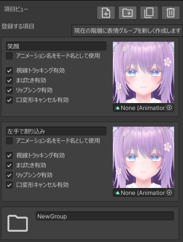

表情グループの名前は自由に変更できます。今回は「グループ1」に変更します。

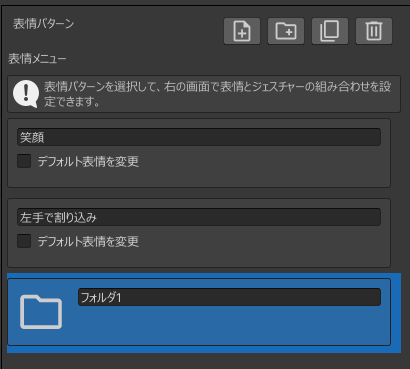

## 表示する階層を切り替える

「グループ1」をダブルクリックすると、「項目ビュー」で「グループ1」の中身が表示されるようになります。

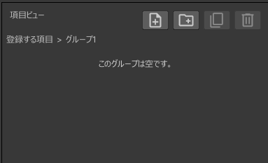

さっきまで表示されていた階層に戻りたい場合は、「階層ビュー」で「登録する項目」をクリックします。

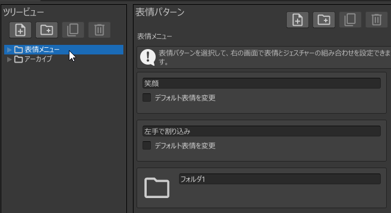

「階層ビュー」で「▶」をクリックすると、表情グループの中身が表示されるようになります。  
ここで「階層ビュー」の「グループ1」をクリックすると、ふたたび「グループ1」の中身が表示されるようになります。

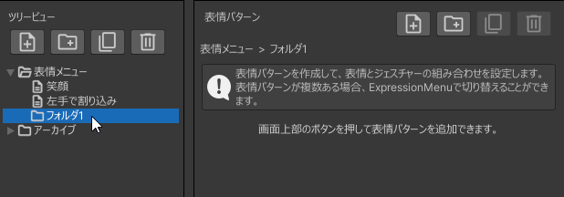

:::tip
「項目ビュー」の上部には、現在の階層が表示されています。
ここをクリックすることでも階層を移動できます。

:::

:::tip
### 「登録する項目」と「登録しない項目」について

「登録する項目」と「登録しない項目」はデフォルトで追加されている表情グループです。

- 登録する項目: この中の表情モードや表情グループがアバターに適用されます
- 登録しない項目: この中の表情モードや表情グループはアバターに適用されません

「登録しない項目」は、「いったんアバターから外したいけど削除したくない」ものを格納しておくのに使用してください。
:::

:::tip
表情モードや表情グループは、ドラッグ＆ドロップで移動することができます。
階層ビューと項目ビューの間で移動することも可能です。
:::

## 表情モードを追加する

「項目ビュー」に「グループ1」を表示した状態で、表情モードをいくつか追加します。  

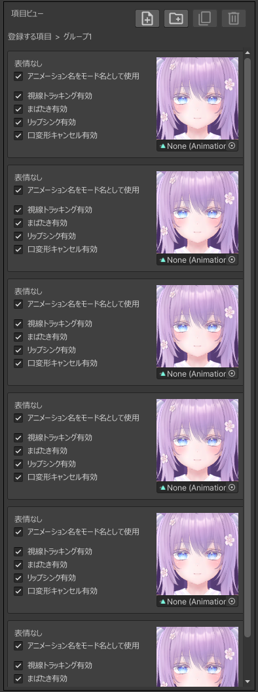

:::tip
- 表情グループは、表情モードや表情グループを8つまで格納できます
- 「登録する項目」は、表情モードや表情グループを7つまで格納できます
- 「登録しない項目」は、表情モードや表情グループを無制限に格納できます
:::

表情モードを追加したら、各表情モードに表情アニメーションを設定します。  
今回は「アニメーション名をモード名として使用」のチェックを外さずに、表情モードの名前を自動で変更してみましょう。
サムネイルにカーソルを合わせるとボタンが表示されるので、左上のボタンを押します。

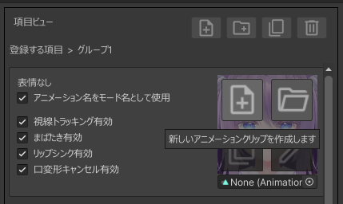

表情アニメーションの保存場所を指定するウインドウが表示されるので、表情アニメーションの名前を「ウインク」に変更して「保存」ボタンを押します。

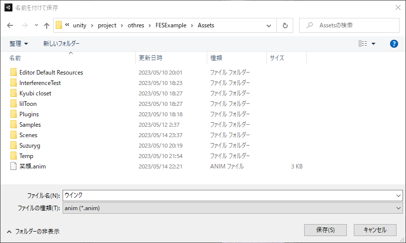

「ウインク」の表情アニメーションが作成され、表情モードの名前が「ウインク」に変更されました。

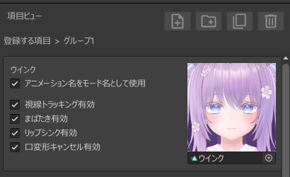

表情エディタを開き、ウインクの表情アニメーションを作ります。

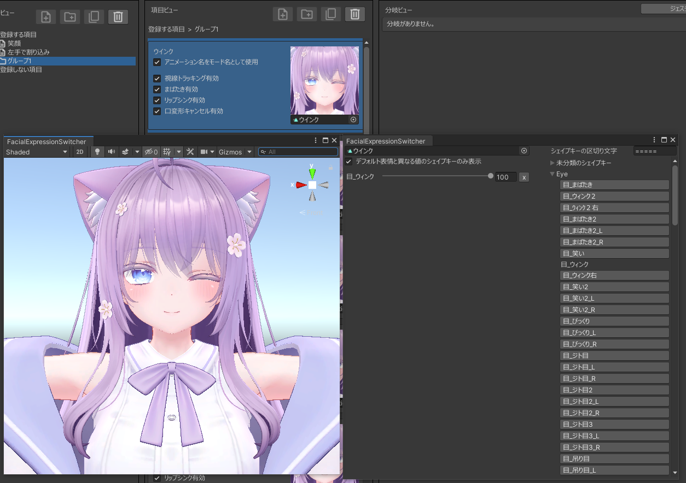

同様にして、他の表情モードにも表情アニメーションを設定します。

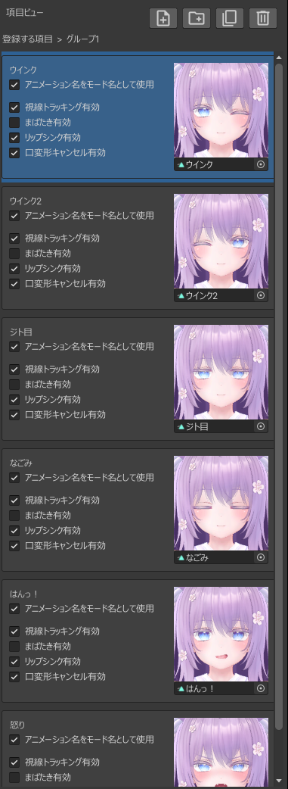

一部の表情モードにはハンドジェスチャーを設定してみましょう。  
「ウインク」表情モードを選択し、分岐ビューで下図のように設定します。

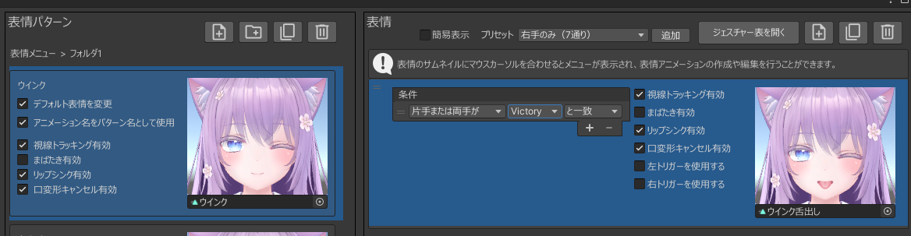

## 表情メニューをアバターに適用する

この状態で「アバターに適用」を実行すれば表情メニューの作成は完了です。  
アバターをアップロードし、下記のような挙動になることを確認してください。

- Expressions Menuで表情を切り替えられる
- 「ウインク」モードでどちらかの手をVictoryにすると表情が変化する

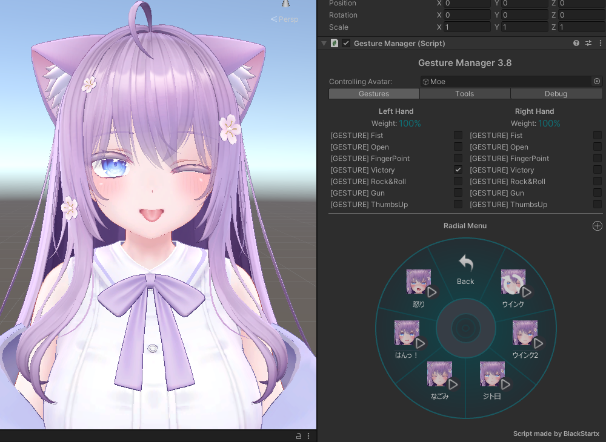
