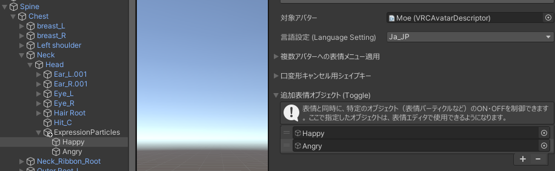
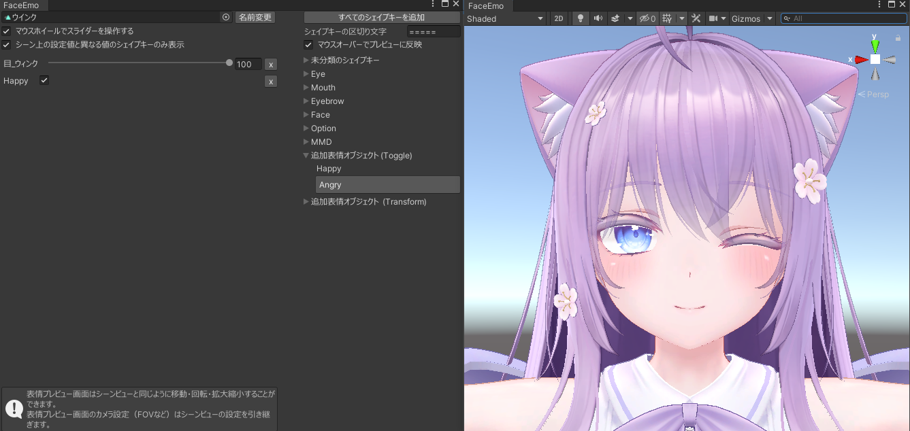

# 将粒子与表情对应

在“添加表情对象 (Toggle)”中添加对象后，可以同时控制表情和对象的开启/关闭。

## 添加对象

在检查器中打开“添加表情对象 (Toggle)”，然后添加你想控制的对象。

:::tip
这里添加的对象在动画未控制时会恢复到默认状态。  
因此，无需为恢复到默认状态制作动画。
:::

---

## 在表情动画中设置对象的开启/关闭

添加到“添加表情对象 (Toggle)”的对象，可以在表情编辑器中使用。  
像形状关键帧一样，将对象添加到动画中并设置开启/关闭状态。  
请注意，粒子的开启/关闭不会反映在动画预览中。

