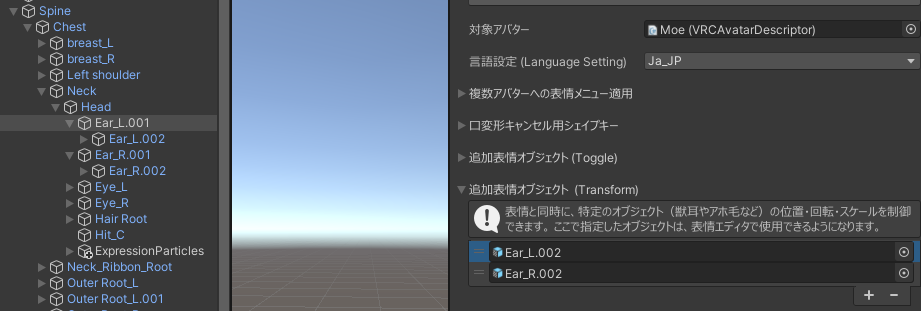
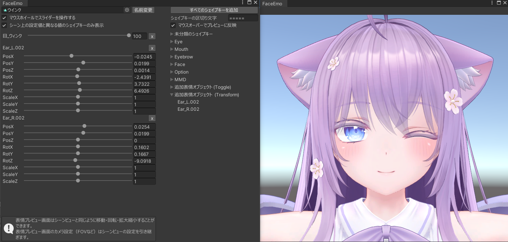

# 将兽耳和瞌睡毛的动作与表情对应

在“添加表情对象 (Transform)”中添加对象后，可以同时控制对象的位置、姿势和缩放以匹配表情。

## 添加对象

在检查器中打开“添加表情对象 (Transform)”，然后添加你想控制的对象。

:::tip
这里添加的对象在动画未控制时会恢复到默认状态。  
因此，无需为恢复到默认状态制作动画。
:::

---

## 在表情动画中设置对象的位置、姿势和缩放

添加到“添加表情对象 (Transform)”的对象，可以在表情编辑器中使用。  
像形状关键帧一样，将对象添加到动画中并设置位置、姿势和缩放。  

