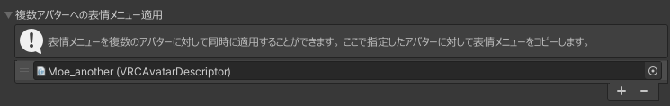
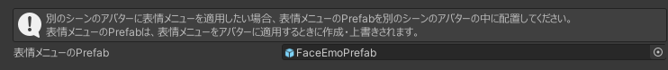
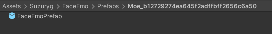

# 将表情菜单应用到多个虚拟形象

在将表情菜单应用到虚拟形象时，可以同时将同样的表情菜单应用到多个虚拟形象。

:::caution
为了使表情菜单共用，脸部形状键需要是共通的。  
基本上请对同一基础体的虚拟形象使用。
:::

## 同一场景中的虚拟形象同时应用表情菜单

在层级视图中选择“FaceEmo”对象，在检查器中打开“将表情菜单应用到多个虚拟形象”。  
点击“+”按钮添加目标虚拟形象，并指明要应用表情菜单的虚拟形象。

在此状态下，将表情菜单应用到虚拟形象时，表情菜单会被复制到指定的虚拟形象。

---

## 在不同场景中的虚拟形象同时应用表情菜单

在层级视图中选择“FaceEmo”对象，在检查器中打开“将表情菜单应用到多个虚拟形象”。  
点击“表情菜单的Prefab”后，会在Project视图中选择Prefab。

:::tip
“表情菜单的Prefab”在初始状态下为None，会在将表情菜单应用到虚拟形象时生成。
:::

将此Prefab放入虚拟形象中后，在上传虚拟形象时会自动应用表情菜单。  
每次将表情菜单应用到虚拟形象时，Prefab内容都会更新。

