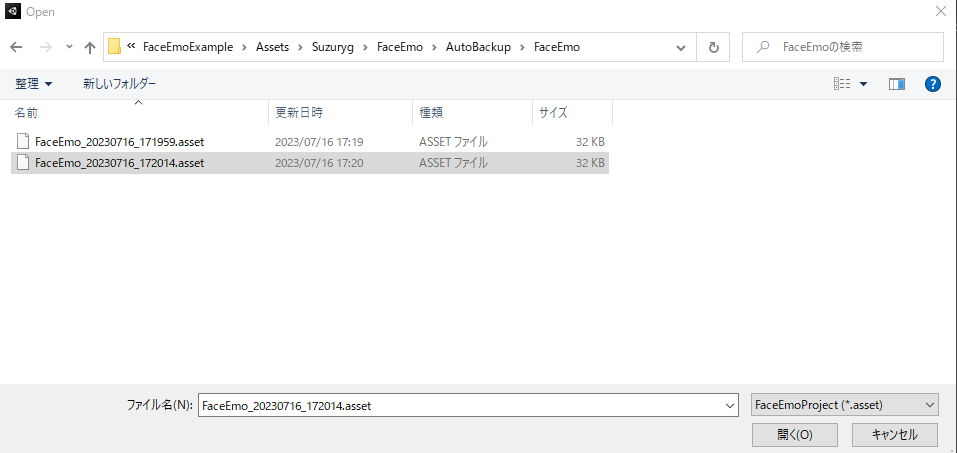
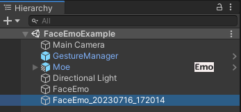

# 从自动备份中还原表情菜单

如果因某些原因丢失了制作的表情菜单，可以从自动备份中恢复。

在工具栏中依次点击“FaceEmo”→“Restore Menu”。

会弹出文件选择界面，从“Assets/Suzuryg/FaceEmo/AutoBackup”目录中选择用来恢复的备份数据。

:::tip
- 自动备份会在将表情菜单应用到虚拟形象时自动创建
- 每个表情菜单会最多存储100个备份数据，超过部分会从最旧的开始删除
- 备份数据不包含动画片段，因此无法恢复动画片段
:::

选择好备份数据后，界面会显示已还原的表情菜单，并在层级视图中生成对应的对象。

