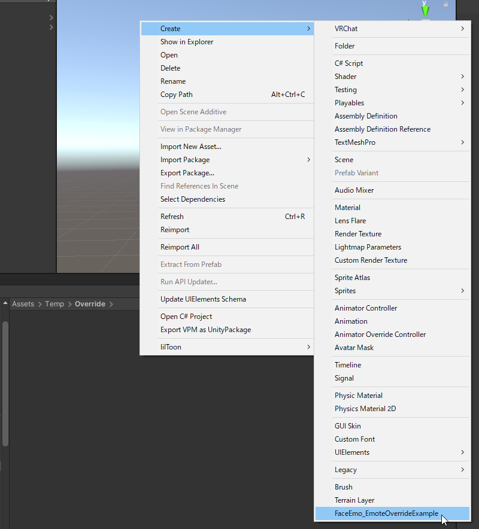
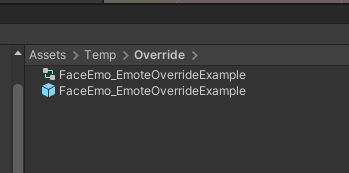
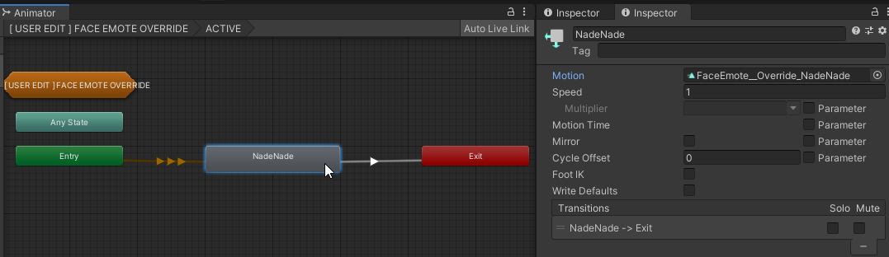
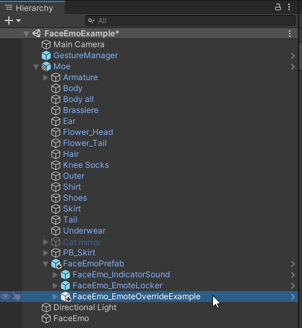

# 设置被抚摸时的表情

可以按照以下步骤，设置当特定部位被触碰时所触发的表情。

在 Project 视图中右键点击，选择「Create」→「FaceEmo_EmoteOverrideExample」，会生成 Prefab 和 AnimatorController。

打开生成的 AnimatorController，双击「ACTIVE」。

点击「NadeNade」，在「Motion」中设置你想使用的表情动画。

将 Prefab 放入 Hierarchy，并放置在「FaceEmoPrefab」内部。  
保持此状态上传 Avatar 后，当其他玩家的手触碰到头像部时，表情将会被覆盖。

:::tip
如果 Avatar 中不存在「FaceEmoPrefab」，请先将表情菜单应用到 Avatar 上。
:::

:::tip
以 FaceEmo_EmoteOverrideExample 为基础进行修改，也可以为除头部外的部位设置 Contact。
:::
