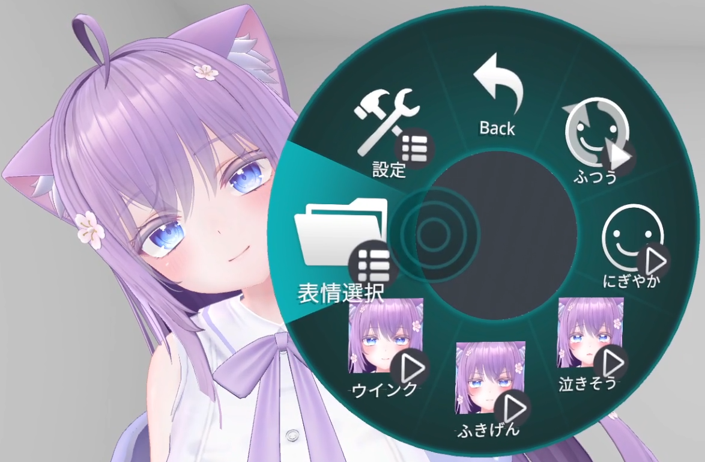
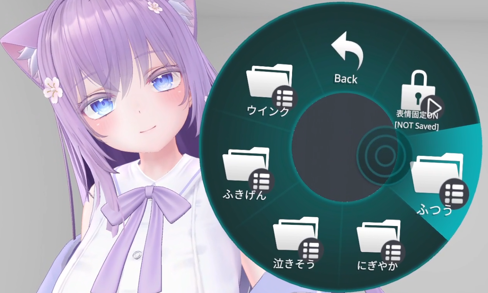
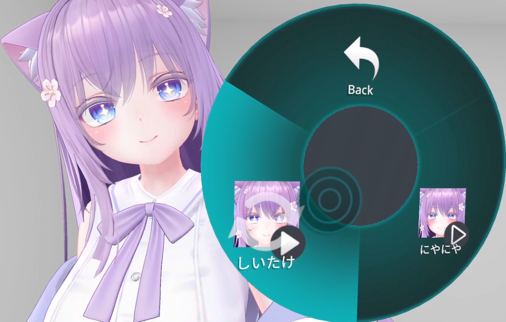
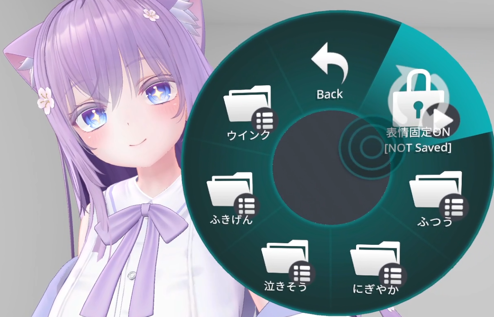
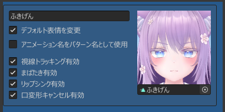
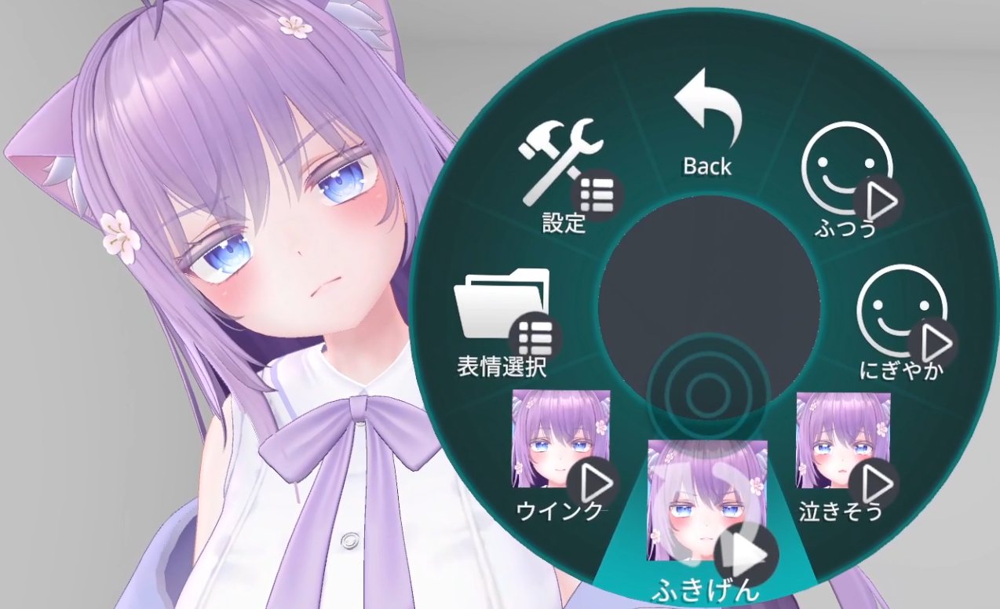
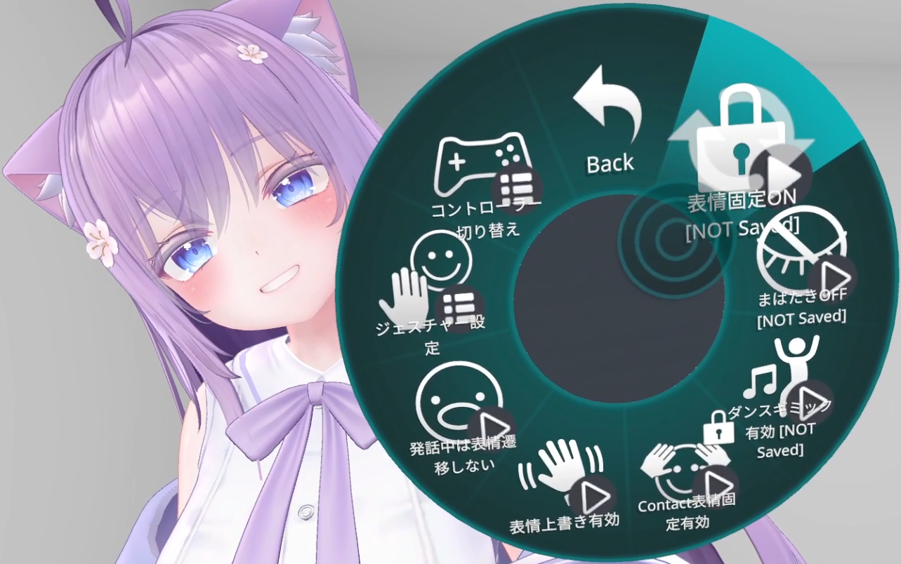
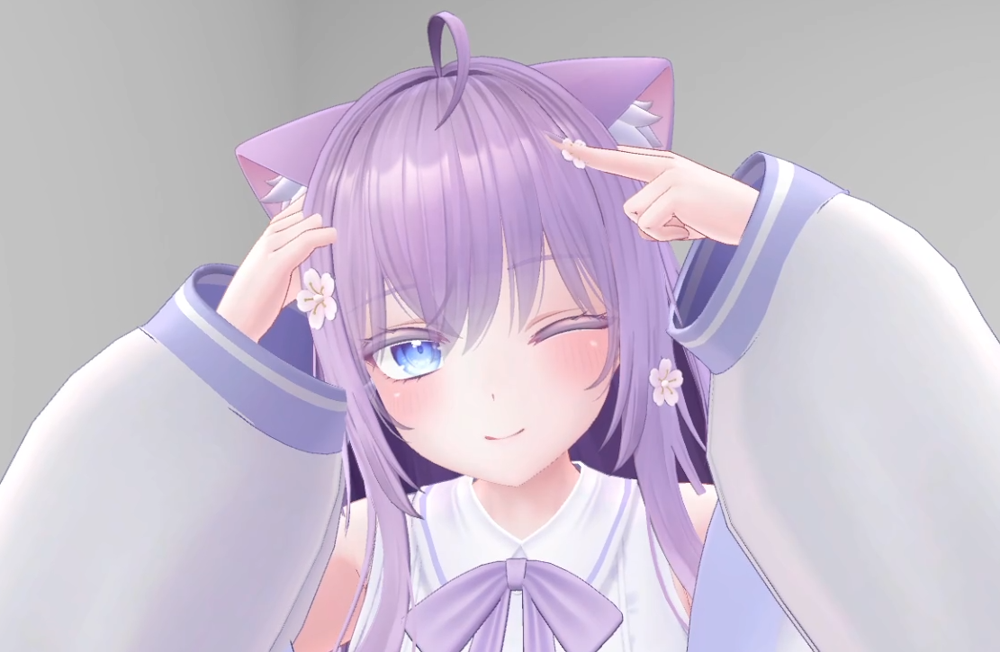

# 固定表情

可以通过以下任意方法来**固定表情**：

- [在「表情选择」菜单中选择表情](#在表情选择菜单中选择表情)
- [添加用于固定的表情模式](#添加用于固定的表情模式)
- [启用「表情固定ON」](#启用表情固定on)
- [使用「Contact表情固定」](#使用contact表情固定)

## 在「表情选择」菜单中选择表情

从 Expression Menu 打开「FaceEmo」→「表情选择」。

:::caution
当「表情选择」菜单处于打开状态时，**手势表情切换**将失效。  
如果手势无法改变表情，请确认左右任意一侧的 Expression Menu 是否正在打开「表情选择」菜单。
:::

每个表情模式中的表情都会被分类进不同的文件夹，请选择包含你想固定表情的表情模式。

此时选择的表情将会被**固定使用**，与手势无关。  

:::tip
- 如果表情模式中包含 **9 个以上**的表情，将会每 **8 个**分成一个文件夹。
- 如果表情模式设置了默认表情，默认表情也会显示在此处。
:::

退出「表情选择」菜单后，表情固定会被解除。  
如果希望在退出「表情选择」菜单后仍保持固定，请启用菜单中的「表情固定ON」。

---

## 添加用于固定的表情模式

通过添加**仅设置默认表情**的表情模式，也可以像「表情选择」菜单一样选择并固定表情。  
表情模式可以添加在任意层级，因此常用的固定表情推荐使用这种方式设置。

---

## 启用「表情固定ON」

在 Expression Menu 中打开「FaceEmo」→「设置」→ 启用「表情固定ON」，即可在**启用瞬间**固定当前表情。  
关闭「表情固定ON」后，固定状态会被解除。

---

## 使用「Contact表情固定」

在 Expression Menu 中打开「FaceEmo」→「设置」→ 启用「Contact表情固定ON」，即可启用 Contact 方式的表情固定功能。

将双手放在头上 **2 秒**，会播放音效并固定当前表情。  
再次执行相同动作，会播放音效并**解除固定**。

