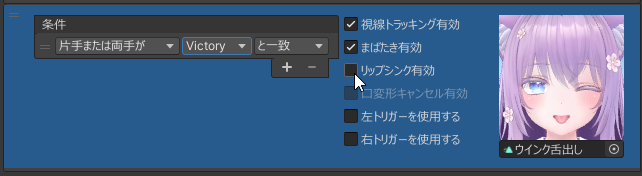
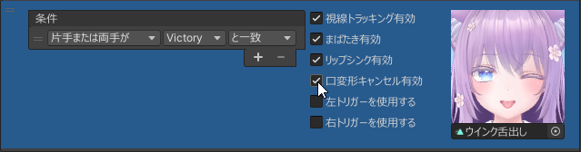
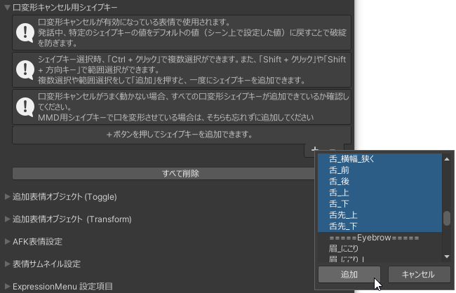

# リップシンクで表情が破綻しないようにする

口が開いている表情のときにリップシンクが動くと、表情が破綻してしまうことがあります。  
これについて、下記のどちらかの方法で対応することができます。
- [リップシンクを無効にする](#リップシンクを無効にする)
- [リップシンク中に口の変形をキャンセルする](#リップシンク中に口の変形をキャンセルする)

## リップシンクを無効にする

各表情について「リップシンク有効」のチェックを外すと、その表情ではリップシンクが行われなくなります。

---

## リップシンク中に口の変形をキャンセルする

各表情について「口変形キャンセル」をチェックすると、口変形キャンセルの機能が有効になります。  
口変形キャンセルが有効になっている表情では、発話中に特定のシェイプキーをデフォルトの値（シーン上で設定した値）に戻すことができます。

デフォルト値に戻すシェイプキーは、インスペクタの「口変形キャンセル用シェイプキー」で設定します。

:::caution
口変形キャンセルがうまく動かない場合、すべての口変形シェイプキーが追加できているか確認してください。  
MMD用シェイプキーで口を変形させている場合は、そちらも忘れずに追加してください。
:::
