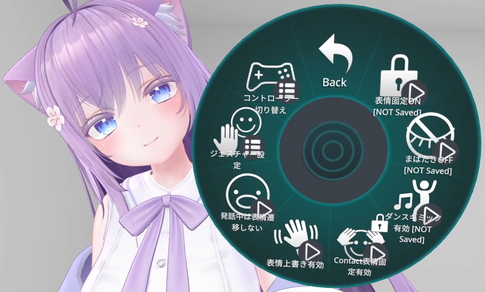

# 在 Expression Menu 中修改表情设置

通过 Expression Menu 打开「FaceEmo」→「设置」，即可修改表情相关设置。

|
项目名
|
设置内容
|
|:-:|:-|
|表情固定ON|开启后，可以在开启期间固定表情。|
|眨眼OFF|开启后，可禁用眨眼。|
|舞蹈机关|开启后，舞蹈机关动作期间表情会随之联动。 由于 FX Layer 功能会被禁用，若使用了换装等功能，将恢复为默认状态。|
|Contact表情固定|开启后，可以使用 Contact 方式的表情固定功能。 双手放在头上 2 秒会播放音效并固定当前表情。 若表情已固定，再次执行相同动作会解除固定。|
|表情覆盖|开启后，可以使用 Contact 方式的表情覆盖功能。 需确保 Avatar 已集成 FaceEmo_EmoteOverrideExample。 [关于 Contact 表情覆盖功能的说明请见此处。](../contact-override)|
|发话中不切换表情|开启后，在说话期间表情将不会变化。 若某些表情禁用了嘴型同步，启用此项可防止嘴巴保持张开状态。|
|手势设置|可修改用于切换表情的手势设置。 左右互换：交换左右手的手势操作。 禁用左手：禁用左手手势切换表情（视为 Neutral）。 禁用右手：禁用右手手势切换表情（视为 Neutral）。|
|控制器切换|可禁用在不同控制器上容易误触的手势。 Quest 控制器：禁用 Open 手势切换表情（视为 Neutral）。 Index 控制器：禁用 Fist 手势切换表情（视为 Neutral）。|

要设置添加到设置菜单中的项目以及其初始值，请在检视器的「Expression Menu設定項目」中进行配置。

