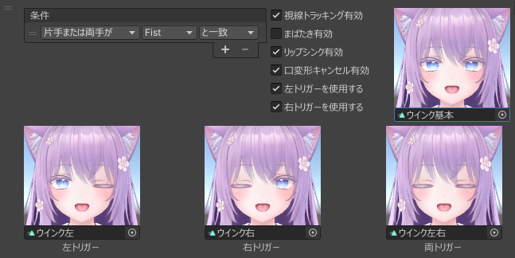

# 根据扳机按压量变化表情

当表情条件中包含 Fist（握拳）时，可以根据**扳机的按压量**来动态改变表情。

:::tip
在 VRChat 中，当手势为 Fist 时，可以获取扳机的模拟输入值（按压深度）。
:::

- 勾选「使用左扳机」或「使用右扳机」即可启用相应的扳机设置  
- 在「左扳机」「右扳机」「双扳机」处，设置当扳机被按下时所使用的表情

:::caution
### 关于扳机设置的注意事项
- 即使在[设置菜单](../setting-menu)的「手势设置」中反转了左右手手势，扳机的左右也**不会反转**
- 即使在[设置菜单](../setting-menu)的「手势设置」中禁用了左右手手势，**扳机按压量变化仍然有效**
- 若在按住扳机时切换为 Fist 以外的手势，可能会导致扳机按压值残留  
  - 若想将按压值恢复为 0，请保持 Fist 状态并**缓慢松开扳机**
  - 在 1.5.1 及之后的版本中，此问题已修复
- 如果存在使用双手扳机的表情，请在「头像应用设置」中启用「平滑化扳机按压量」  
  - 「平滑化扳机按压量」默认是启用的
:::
