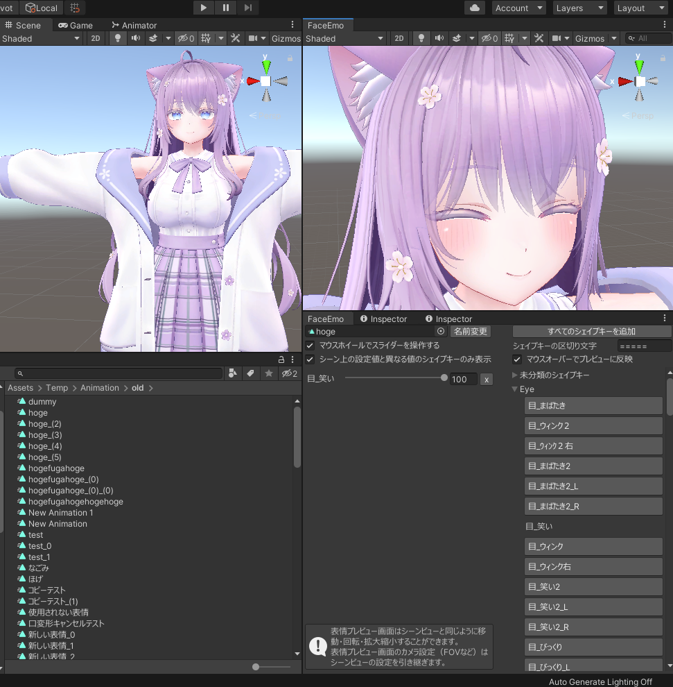

# 表情エディタ

表情エディタでは、表情アニメーションの編集を行うことができます。

## 表情エディタを開く

表情サムネイルにマウスカーソルを合わせると、表情アニメーションに関する操作を行うボタンが表示されます。  
ここで、「開く」以外のボタンを押すと表情エディタが開きます。

|
アクション
|
ボタン位置
|
説明
|
|:-:|:-:|:-|
|新規作成|左上|新しいアニメーションクリップを作成します。 表情エディタを開き、新しく作成されたアニメーションクリップを編集します。|
|開く|右上|既存のアニメーションクリップを開きます。|
|合成|左下|アニメーションクリップを2つ選んで合成します。 同じシェイプキーが使われている場合、値が大きい方を優先します。|
|編集|右下|表情エディタを開き、セットされているアニメーションクリップを編集します。|

:::tip
アニメーションを合成するときに片方を「None」にして合成を実行すると、もう片方のアニメーションがそのままコピーされます。

:::

---

## シェイプキーを追加する

表情アニメーションに追加したいシェイプキーをクリックするとシェイプキーが追加され、プレビューが更新されます。  
シェイプキーの値を変更したい場合、各シェイプキーのスライダーを動かすか、テキストボックスに数値を入力します

:::caution
シェイプキーを追加したとき、下記の警告が出ていないか確認してください。

|
警告メッセージ
|
説明
|
|:-|:-|
|「まばたき用シェイプキーが含まれています！」|まばたきアニメーションに上書きされ、 表情アニメーションが正しく再生されない可能性があります。|
|「リップシンク用シェイプキーが含まれています！」|リップシンクが正しく動かなくなる可能性があります。|
:::

---

## シェイプキーをカテゴリごとに表示する

シェイプキーの区切り文字を入力することで、シェイプキーをカテゴリごとに表示することができます。

シェイプキーの区切り文字はアバターごとに異なります。
- 「=====Eye=====」のようなカテゴリ名となっている場合、「=====」と入力してください
- 「\*\*\*\*\*Eye\*\*\*\*\*」のようなカテゴリ名となっている場合、「\*\*\*\*\*」と入力してください

---

## プレビュー画面を操作する

プレビュー画面は、Unityのシーンビューと同様の操作で移動・回転・拡大縮小することが可能です。

プレビュー画面のカメラ設定はシーンビューの設定を引き継ぎます。  
たとえば、シーンビューでFOVを変更して作業している場合、プレビュー画面にも変更したFOVが適用されます。

---

## レイアウトを変更する

表情エディタのウインドウ配置は自由に変更することができます。
変更したウインドウ配置は、次回起動時にも反映されます。

