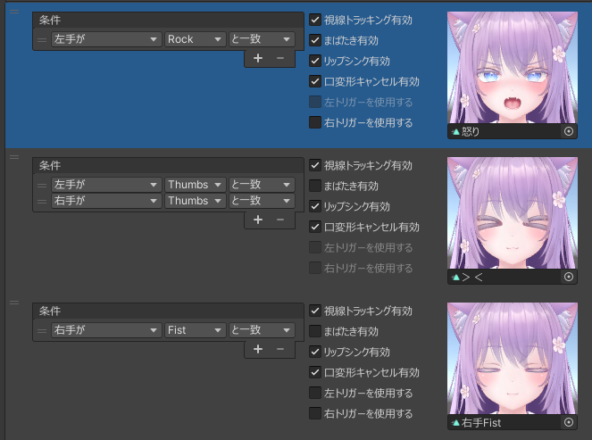

# 表情

本ツールでは、表情が変化する条件を下記の3つの組み合わせで指定します。
- 手の種類
- ハンドジェスチャーの種類
- 一致する or 一致しない

|
条件
|
挙動
|
|:-:|:-|
|「左手が」「Fist」「と一致」|左手がFistのときに表情が変化します（右手の状態は考慮しません）|
|「両手が」「Open」「と一致」|両手がOpenのときに表情が変化します|
|「片手が」「Point」「と一致」|左手か右手がPointのときに表情が変化します（両手がPointのときは変化しません）|
|「片手または両手が」「Victory」「と一致」|左手か右手がVictoryのときに表情が変化します（両手がVictoryのときも変化します）|

条件は複数組み合わせて使用することができます。

|
条件
|
挙動
|
|:-:|:-|
|「片手が」「Rock」「と一致」 + 「片手が」「Gun」「と一致」|左手Rock 右手 Gun、または左手Gun 右手 Rock のときに表情が変化します|

複数の表情が存在する場合、上から順番に判定します。

- 例えば下記の順番で2つの表情が存在する場合は、1番目の表情が優先されるため、左手がFistのとき1番目の表情が使用されます
    - 「左手が」「Fist」「と一致」
    - 「片手が」「Fist」「と一致」
- 表情の順番はドラッグで入れ替え可能です
- どの表情が優先されているかは、ジェスチャー表で確認することができます

各表情について、下記の設定を変更することができます。

|
項目名
|
設定内容
|
|:-:|:-|
|視線トラッキング有効|疑似アイトラッキングの有無を設定します。まばたきの有無とは別に設定できます。|
|まばたき有効|まばたきの有無を設定します。目を閉じている表情ではまばたきを無効にしてください。|
|リップシンク有効|リップシンクの有無を設定します。  発話中の表情の破綻を防ぐ場合はリップシンクを無効にするか、口変形キャンセルを使用してください。|
|口変形キャンセル有効|発話中、特定のシェイプキーの値をデフォルトの値（シーン上で設定した値）に戻すことで破綻を防ぎます。 デフォルト値に戻すシェイプキーは、インスペクタの「口変形キャンセル用シェイプキー」で指定してください。|
|左トリガーを使用する|左手トリガーの押し込み量に応じて表情を変化させます。 トリガーを押し込んだときの表情を追加で設定してください。  トリガーの押し込みは左手がFistのときのみ有効です。|
|右トリガーを使用する|右手トリガーの押し込み量に応じて表情を変化させます。 トリガーを押し込んだときの表情を追加で設定してください。  トリガーの押し込みは右手がFistのときのみ有効です。|
