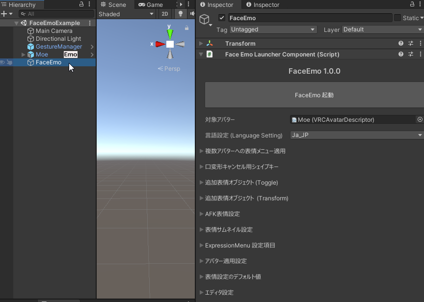
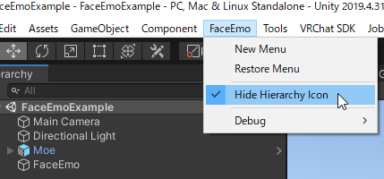

# 表情菜单

使用本工具创建的表情菜单会作为对象保存在场景中。

- 复制对象即可复制表情菜单  
- 修改复制后的表情菜单时，通常不会影响原菜单  
    - **但对动画剪辑的修改是例外**，会同时影响原菜单与复制菜单

可通过工具栏执行「FaceEmo」→「New Menu」来新建表情菜单。

在层级视图（Hierarchy）中选中表情菜单对象，即可启动本工具或修改表情菜单设置。

点击层级视图中 Avatar 右侧显示的图标时，会执行以下操作：

- 检查场景中的所有表情菜单（按名称排序）  
- 若点击的 Avatar 与「目标 Avatar」一致，则打开对应的表情菜单  
- 若不存在与该 Avatar 绑定的表情菜单，则新建一个并打开

在工具栏中启用「FaceEmo」→「Hide Hierarchy Icon」可隐藏 Avatar 右侧的图标。

