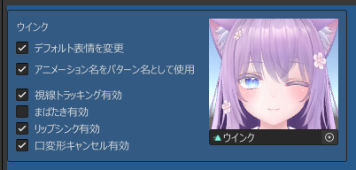

# 表情模式

在本工具中，可以通过 Expression Menu 选择不同的**表情模式**，以切换多组「手势 + 表情」组合。

启用「更改默认表情」后，可以为表情模式设置默认表情。

- 默认表情用于当左右手的手势不符合任意表情条件时显示  
- 若未设置默认表情，将使用场景中当前面部 Shape Key 的值作为默认表情

默认表情可调整以下设置：

|
项目名
|
设置内容
|
|:-:|:-|
|使用动画名作为模式名|使用所绑定动画剪辑的名称作为表情模式名称。|
|启用视线追踪|设置是否启用伪视线追踪。与眨眼设置独立。|
|启用眨眼|设置是否允许眨眼。若表情为闭眼状态，请禁用眨眼。|
|启用嘴型同步|设置是否启用嘴型同步。 若要防止说话时表情崩坏，请禁用嘴型同步或使用口部变形取消功能。|
|启用口部变形取消|在说话时，将特定 Shape Key 的值恢复为默认值（场景中设置的值），以防止崩坏。 需在检视器中「口変形キャンセル用シェイプキー」处指定要恢复的 Shape Key。|
