# 设置双手手势组合

以下示例展示了一个稍微复杂的表情菜单：

- 默认情况下通过**右手手势**切换表情  
- 当**左手手势为 Rock** 时，右手表情会被覆盖为「愤怒」表情  
- 当**左右手手势均为 Thumbs** 时，右手表情会被覆盖为「><」表情  

---

## 添加表情模式

新建一个表情模式，并将其命名为「左手干预」。

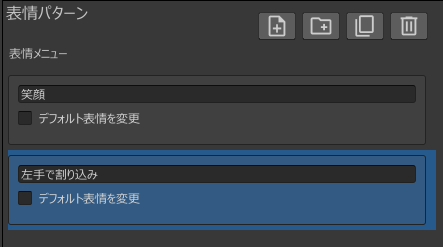

将「默认表情模式」修改为「左手干预」。

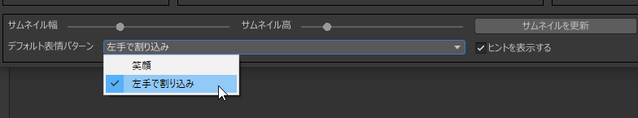

:::tip
当存在多个表情模式时，可以通过此方式设置默认启用的表情模式。
:::

---

## 添加表情

选择「左手干预」模式，按下图设置右手表情。

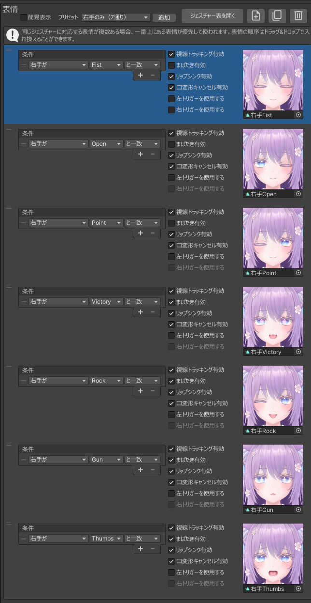

:::tip
使用**表情预设功能**可以一次性添加多个表情。
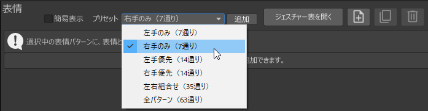
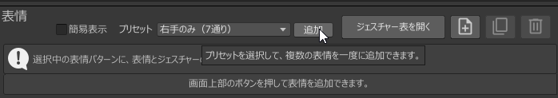
:::

接着设置左手触发的表情覆盖，如下图所示。

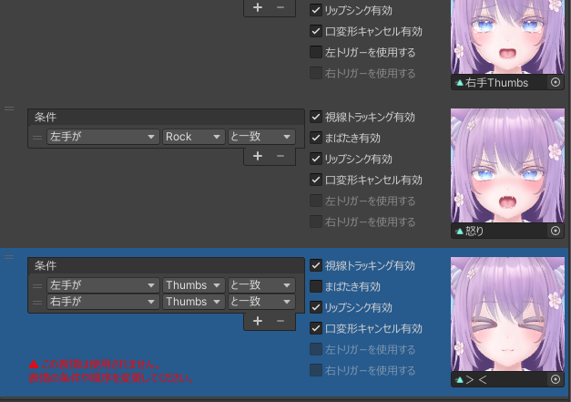

:::tip
点击「+」按钮可添加新的表情条件。

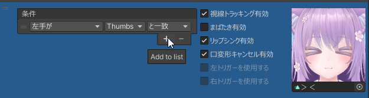
:::

---

## 修改表情优先级

点击「打开手势表」按钮以打开手势表。

:::tip
通过手势表可查看双手手势组合对应的表情。  
详情请参见 [参考资料 > 手势表](../../reference/gesture-table)。
:::

选择「愤怒」表情后，可以看到仅当左手为 Rock 且右手为 Neutral 时才会触发「愤怒」表情。

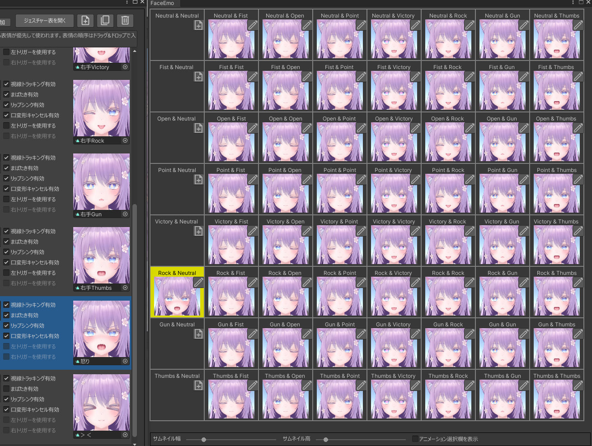

此外，由于「><」表情的优先级低于「右手 Thumbs」表情，因此不会被使用。

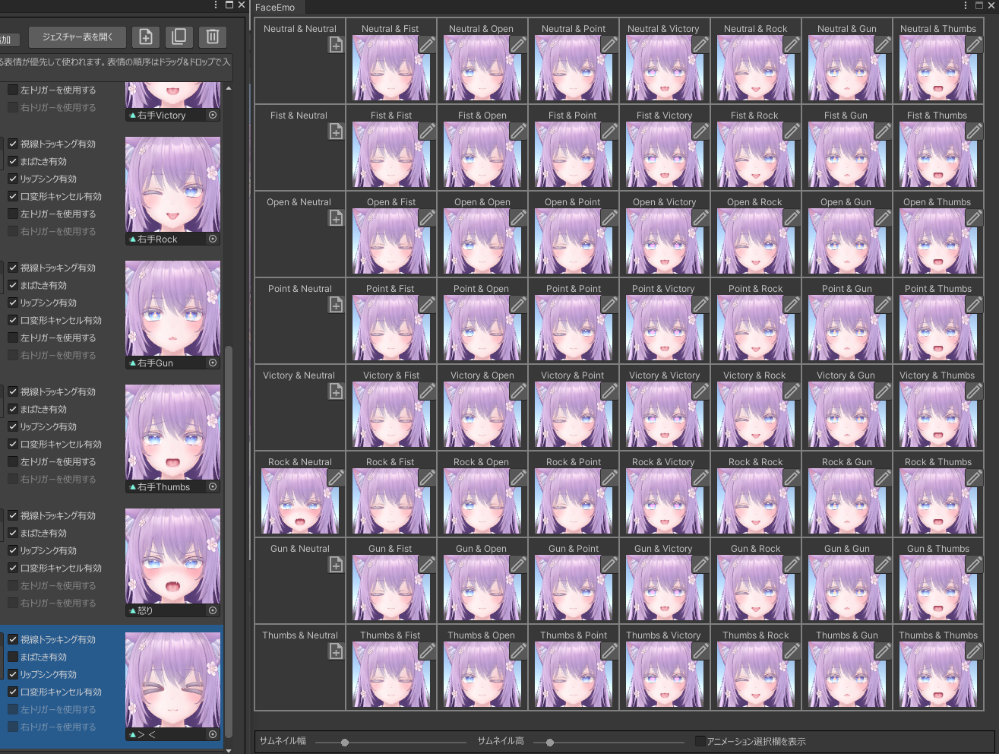

将「愤怒」和「><」表情拖到最上方即可调整优先级。  
手势表更新后，如下图所示，当左手为 Rock 时始终会显示「愤怒」表情。

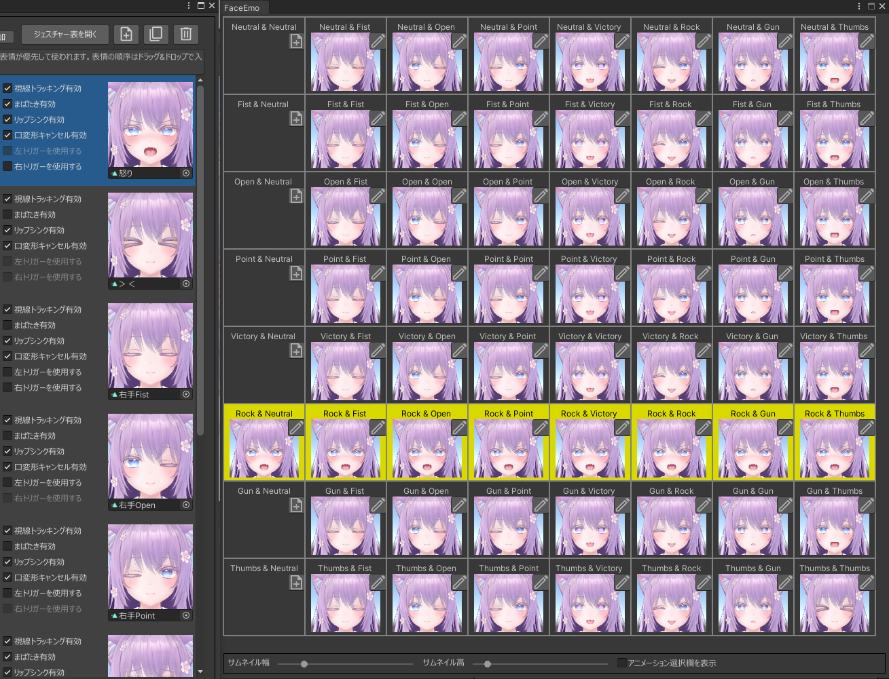

同时，当双手均为 Thumbs 时，会显示「><」表情。

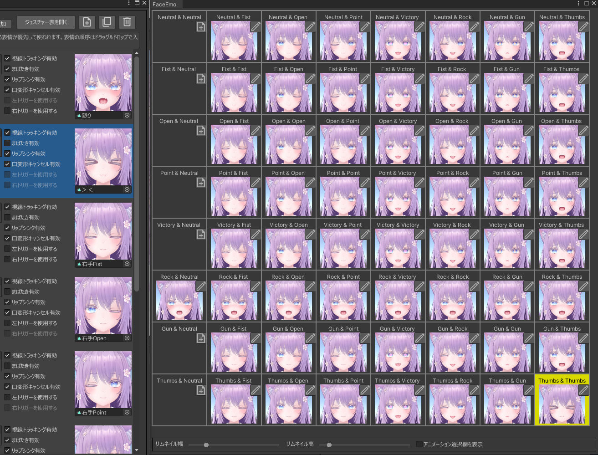

---

## 将表情菜单应用到 Avatar

此时执行「应用到 Avatar」即可完成表情菜单的制作。  
上传 Avatar 后应表现如下：

- 默认通过右手手势切换表情  
- 当左手为 Rock 时，右手表情会被覆盖为「愤怒」表情  
- 当左右手均为 Thumbs 时，右手表情会被覆盖为「><」表情  

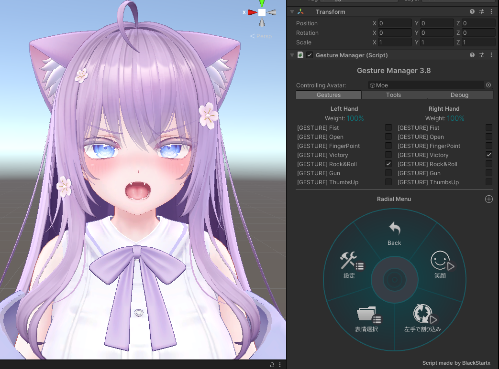
