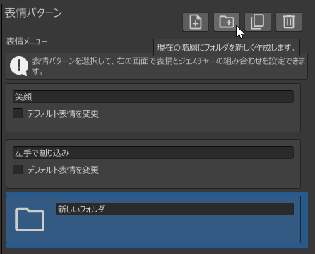
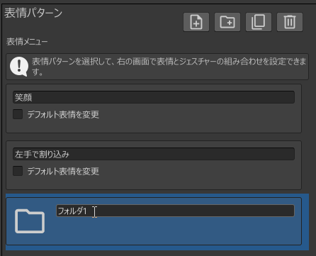
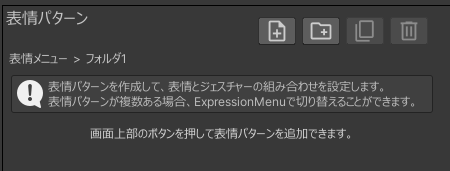
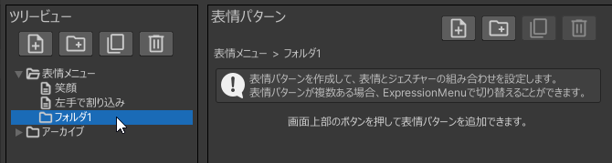
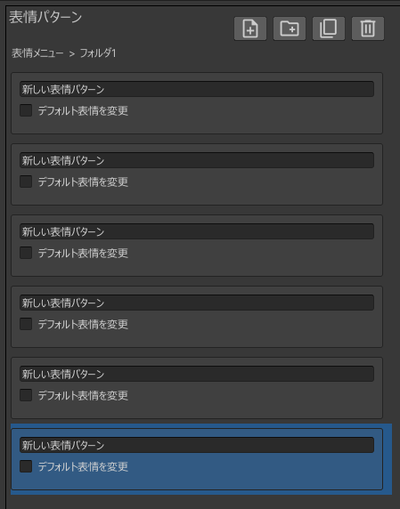
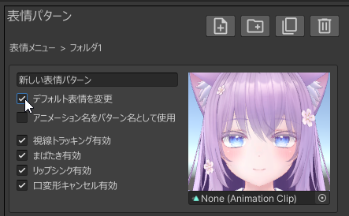
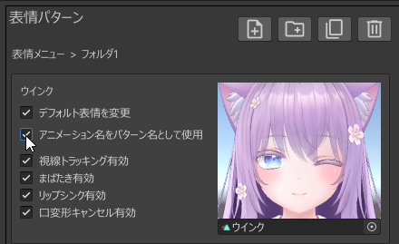

# たくさんの表情パターンを作る

表情パターンをたくさん追加し、Expression Menuで切り替えられるようにしてみましょう。

## フォルダを追加する

Expression Menuに追加できる項目の数には限りがあるため、
たくさんの表情パターンを作るためにはグループ分けが必要になります。  
「表情パターン」ビューの左から2番目のボタンをクリックし、フォルダを追加してみましょう。

フォルダの名前は自由に変更できます。今回は「フォルダ1」に変更します。

---

## 表示する階層を切り替える

「フォルダ1」をダブルクリックすると、「表情パターン」ビューで「フォルダ1」の中身が表示されるようになります。

さっきまで表示されていた階層に戻りたい場合は、「ツリービュー」で「表情メニュー」をクリックします。

「ツリービュー」で「▶」をクリックすると、フォルダの中身が表示されるようになります。  
ここで「ツリービュー」の「フォルダ1」をクリックすると、ふたたび「フォルダ1」の中身が表示されるようになります。

:::tip
### 「表情メニュー」と「アーカイブ」について

「表情メニュー」と「アーカイブ」はデフォルトで追加されているフォルダです。

- 表情メニュー: この中の表情パターンやフォルダがアバターに適用されます
- アーカイブ: この中の表情パターンやフォルダはアバターに適用されません

「アーカイブ」は、「いったんアバターから外したいけど削除したくない」ものを格納しておくのに使用してください。
:::

:::tip
表情パターンやフォルダは、ドラッグ＆ドロップで移動することができます。
ツリービューと表情パターンビューの間で移動することも可能です。
:::

---

## 表情パターンを追加する

「表情パターン」ビューに「フォルダ1」を表示した状態で、表情モードをいくつか追加します。  

:::tip
- フォルダは、表情パターンやフォルダを8つまで格納できます
- 「表情メニュー」は、表情パターンやフォルダを6つまで格納できます
- 「アーカイブ」は、表情パターンやフォルダを無制限に格納できます
:::

表情パターンを追加したら、各表情パターンに表情を設定します。  
今回は「デフォルト表情を変更」にチェックを入れて、Expression Menuで表情を切り替えられるようにしてみましょう。

:::tip
Expression Menuでの表情切り替えは、[自動生成される「表情選択」メニュー](../../optional-functions/emote-lock/)でも行うことができます。  
「デフォルト表情を変更」での表情切り替えには下記の利点があるので、好みに応じて使い分けてください。
- 浅い階層に項目を追加できるので、切り替えがしやすい
- ハンドジェスチャーによる表情変化を設定できる
:::

「表情」ビューで表情アニメーションを設定する場合と同様に、デフォルト表情の表情アニメーションを設定します。

「アニメーション名をパターン名として使用」のチェックを入れることで、表情パターンの名前を自動で設定することができます。

同様にして、他の表情パターンにもデフォルト表情を設定します。  
まばたき等の設定も適切に変更してください。

一部の表情パターンにはハンドジェスチャーを設定してみましょう。  
「ウインク」表情パターンを選択し、「表情」ビューで下図のように設定します。

---

## 表情メニューをアバターに適用する

この状態で「アバターに適用」を実行すれば表情メニューの作成は完了です。  
アバターをアップロードし、下記のような挙動になることを確認してください。

- Expression Menuで表情を切り替えられる
- 「ウインク」表情パターンでどちらかの手をVictoryにすると表情が変化する

