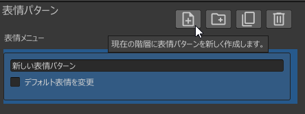
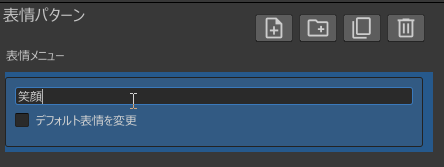
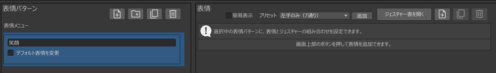
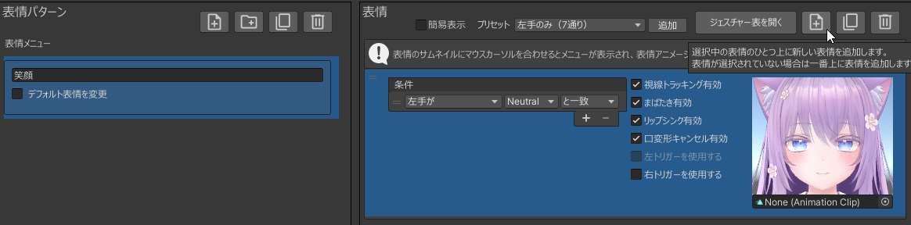
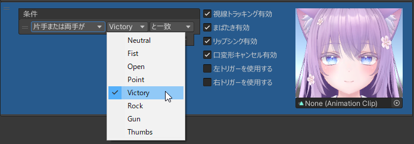
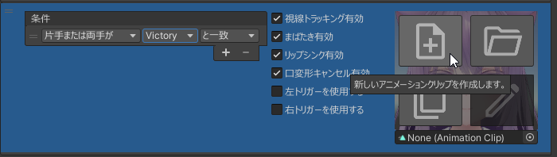
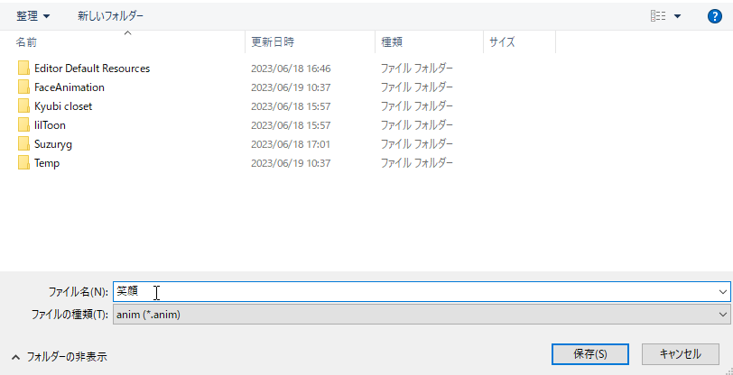
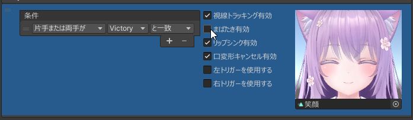
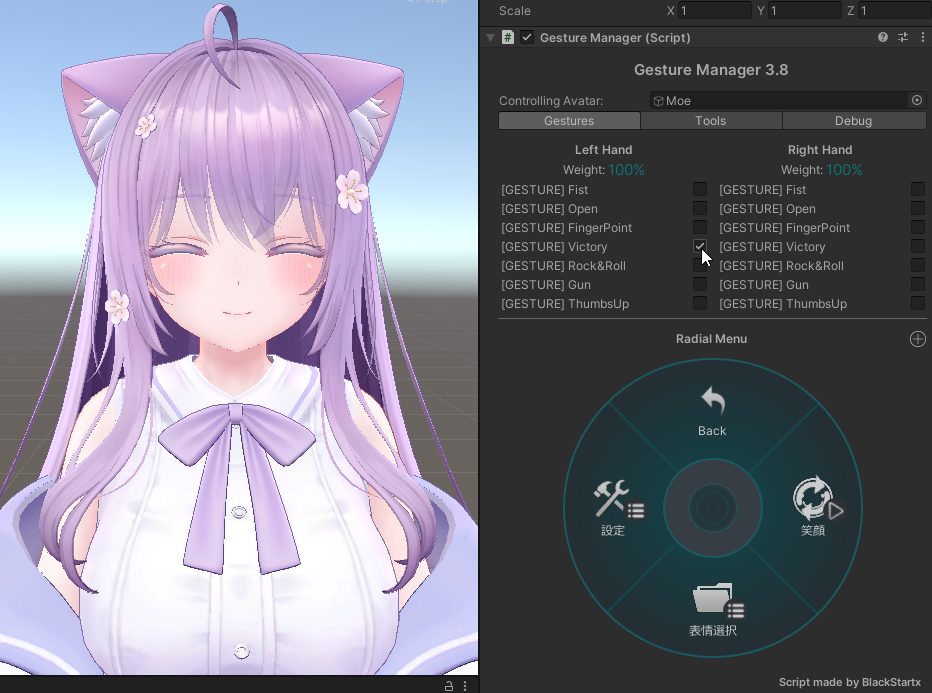
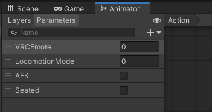

# 创建一个简单的表情菜单

以下示例展示如何使用本工具创建一个简单的表情菜单：  
当**任意一只手的手势为 Victory** 时，表情变为笑脸。

---

## 新建表情菜单

当 Avatar 已放置在层级视图（Hierarchy）中时，其右侧会显示本工具的图标。

点击图标后，会自动创建名为「FaceEmo」的对象，并打开工具窗口。

:::tip
表情菜单会保存到此「FaceEmo」对象中。  
若对象已存在，则点击图标会打开已保存的表情菜单。  
当场景中有多个 Avatar 时，其对应关系详见  
[参考资料 > 表情菜单](../../reference/menu)。
:::

---

## 添加表情模式

点击「表情模式」视图最左侧的按钮以添加一个新的表情模式。

将表情模式名称改为「笑脸」。

:::tip
通过添加表情模式，可以在 Expression Menu 中切换表情模式。  
详细说明见 [参考资料 > 表情模式](../../reference/pattern)。
:::

确认「默认表情模式」为「笑脸」。

:::tip
如果 Avatar 中已加载其他表情模式，请在此将默认表情模式更改为「笑脸」。
:::

---

## 添加表情

添加表情模式后，「表情」视图会提示“可通过上方按钮添加表情”。  
点击右上角的按钮以添加表情。

将条件修改为「任意一只或双手为」「Victory」「时匹配」。

:::tip
添加表情后，即可设置手势触发表情切换。  
详细说明见 [参考资料 > 表情](../../reference/expression)。
:::

---

## 创建表情动画

将鼠标悬停在表情缩略图上后，会显示操作按钮，点击左上角的按钮。

弹出保存窗口，将动画命名为「笑脸」，点击「保存」。

动画创建完成后，表情编辑器会自动打开。

:::tip
表情编辑器用于编辑表情动画。  
详细说明见 [参考资料 > 表情编辑器](../../reference/expression-editor)。
:::

点击希望添加的 Shape Key 即可将其加入动画中，预览会自动更新。  
若需修改数值，可拖动滑块或直接输入数值。

:::caution
添加 Shape Key 时，请检查是否出现以下警告：

|
警告信息
|
说明
|
|:-|:-|
|「まばたき用シェイプキーが含まれています！」|该 Shape Key 可能被眨眼动画覆盖，导致表情动画无法正常播放。|
|「リップシンク用シェイプキーが含まれています！」|该 Shape Key 可能影响嘴型同步的正常运行。|
:::

由于在播放笑脸动画时若发生眨眼会导致表情崩坏，请关闭「启用眨眼」。

---

## 将表情菜单应用到 Avatar

点击「应用到 Avatar」按钮，在确认窗口中选择「应用」。

出现「表情菜单生成完成！」提示即表示成功。

- 上传 Avatar 后，表情菜单会通过 Modular Avatar 合并进 Avatar  
- 在层级视图中可看到新增对象「FaceEmoPrefab」  
    - 若需删除表情菜单，只需删除该对象

:::caution
### 无法上传时的处理

若出现下图错误，可能是 VRCSDK 版本不支持 Modular Avatar。  
请更新 VRCSDK 与 Modular Avatar 至最新版。

:::

上传完成后，确认当任意一只手做出 Victory 手势时，表情变为笑脸。

:::caution
### 使用 Gesture Manager 预览时的注意事项

- 不同版本的 Gesture Manager 与 Modular Avatar 可能导致表情菜单无法在预览中生效。  
  可尝试以下步骤：  
  - 未选择 Gesture Manager 对象时点击 Unity 的播放按钮  
  - 进入 Play 模式后再选中 Gesture Manager 对象  
  - 若 Game 视图中 Avatar 无法正常显示，请在 Scene 视图中预览  
- 若触发了 AFK 动作，请在 Action Layer 的 Parameters 中关闭 AFK 选项

:::
